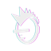
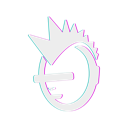
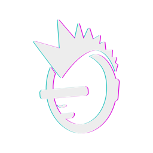
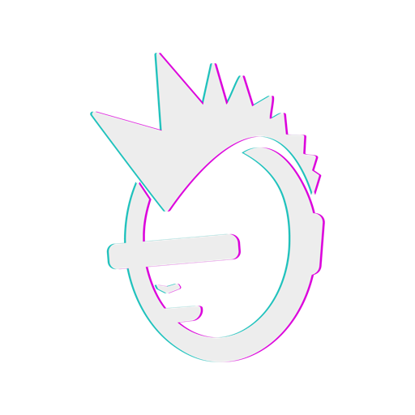
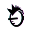
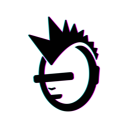
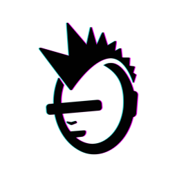
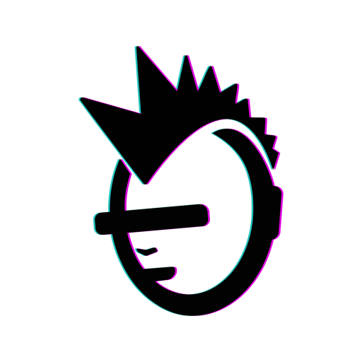
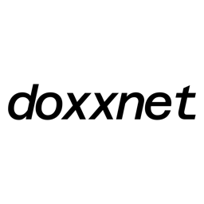
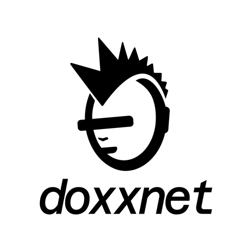

# doxx.net Brand & Style Guide

> **Status:** Active  
> **Last Updated:** 2026-02-04  
> **Brand Guidelines:** MANZO.STUDIO 2026

---

**Copyright (c) 2025-2026 doxx.net corp. All rights reserved.**

DOXXNET, the DOXXNET logo, and the punk isotype are trademarks of doxx.net corp. 
Unauthorized use, reproduction, or distribution of these materials is strictly prohibited.

---

## Brand Concept

The Doxxnet logo represents **resistance against exposure** in a hyper-surveilled digital world.

- **The punk figure** symbolizes rebellion, independence, and defiance toward systems that exploit personal data
- **The line covering the eyes** is a metaphor for anonymity and protection—blocking identification, facial recognition, and unwanted visibility
- **The punk aesthetic** connects to digital counterculture and hacktivism—communities that challenge authority, value privacy, and reject mass surveillance

> *"Privacy is a right, not a privilege."*

---

## Logo Gallery

### Isotype (Punk Symbol)

Use for: App icons, favicons, avatars, watermarks, UI indicators

#### White (for dark backgrounds)

| 64px | 128px | 256px | 512px |
|:----:|:-----:|:-----:|:-----:|
|  |  |  |  |

<details>
<summary>Click for direct links</summary>

```
# PNG (transparent)
https://raw.githubusercontent.com/doxxcorp/style/main/logo-png/isotype-white/isotype-white-32.png
https://raw.githubusercontent.com/doxxcorp/style/main/logo-png/isotype-white/isotype-white-44.png
https://raw.githubusercontent.com/doxxcorp/style/main/logo-png/isotype-white/isotype-white-64.png
https://raw.githubusercontent.com/doxxcorp/style/main/logo-png/isotype-white/isotype-white-88.png
https://raw.githubusercontent.com/doxxcorp/style/main/logo-png/isotype-white/isotype-white-120.png
https://raw.githubusercontent.com/doxxcorp/style/main/logo-png/isotype-white/isotype-white-128.png
https://raw.githubusercontent.com/doxxcorp/style/main/logo-png/isotype-white/isotype-white-132.png
https://raw.githubusercontent.com/doxxcorp/style/main/logo-png/isotype-white/isotype-white-180.png
https://raw.githubusercontent.com/doxxcorp/style/main/logo-png/isotype-white/isotype-white-256.png
https://raw.githubusercontent.com/doxxcorp/style/main/logo-png/isotype-white/isotype-white-512.png
https://raw.githubusercontent.com/doxxcorp/style/main/logo-png/isotype-white/isotype-white-1024.png

# JPEG (dark background #14141E)
https://raw.githubusercontent.com/doxxcorp/style/main/logo-jpg/isotype-white/isotype-white-256-dark-bg.jpg
https://raw.githubusercontent.com/doxxcorp/style/main/logo-jpg/isotype-white/isotype-white-512-dark-bg.jpg
https://raw.githubusercontent.com/doxxcorp/style/main/logo-jpg/isotype-white/isotype-white-1024-dark-bg.jpg
```

</details>

#### Black (for light backgrounds)

| 64px | 128px | 256px | 512px |
|:----:|:-----:|:-----:|:-----:|
|  |  |  |  |

<details>
<summary>Click for direct links</summary>

```
# PNG (transparent)
https://raw.githubusercontent.com/doxxcorp/style/main/logo-png/isotype-black/isotype-black-32.png
https://raw.githubusercontent.com/doxxcorp/style/main/logo-png/isotype-black/isotype-black-44.png
https://raw.githubusercontent.com/doxxcorp/style/main/logo-png/isotype-black/isotype-black-64.png
https://raw.githubusercontent.com/doxxcorp/style/main/logo-png/isotype-black/isotype-black-88.png
https://raw.githubusercontent.com/doxxcorp/style/main/logo-png/isotype-black/isotype-black-120.png
https://raw.githubusercontent.com/doxxcorp/style/main/logo-png/isotype-black/isotype-black-128.png
https://raw.githubusercontent.com/doxxcorp/style/main/logo-png/isotype-black/isotype-black-132.png
https://raw.githubusercontent.com/doxxcorp/style/main/logo-png/isotype-black/isotype-black-180.png
https://raw.githubusercontent.com/doxxcorp/style/main/logo-png/isotype-black/isotype-black-256.png
https://raw.githubusercontent.com/doxxcorp/style/main/logo-png/isotype-black/isotype-black-512.png
https://raw.githubusercontent.com/doxxcorp/style/main/logo-png/isotype-black/isotype-black-1024.png

# JPEG (light background #F7F7F7)
https://raw.githubusercontent.com/doxxcorp/style/main/logo-jpg/isotype-black/isotype-black-256-light-bg.jpg
https://raw.githubusercontent.com/doxxcorp/style/main/logo-jpg/isotype-black/isotype-black-512-light-bg.jpg
https://raw.githubusercontent.com/doxxcorp/style/main/logo-jpg/isotype-black/isotype-black-1024-light-bg.jpg
```

</details>

---

### Logotype (Wordmark)

Use for: Navigation bars, headers, editorial layouts, legal documents

#### White (for dark backgrounds)

| 180w | 256w | 512w |
|:----:|:----:|:----:|
|  |  |  |

<details>
<summary>Click for direct links</summary>

```
# PNG (transparent)
https://raw.githubusercontent.com/doxxcorp/style/main/logo-png/logotype-white/logotype-white-120w.png
https://raw.githubusercontent.com/doxxcorp/style/main/logo-png/logotype-white/logotype-white-180w.png
https://raw.githubusercontent.com/doxxcorp/style/main/logo-png/logotype-white/logotype-white-256w.png
https://raw.githubusercontent.com/doxxcorp/style/main/logo-png/logotype-white/logotype-white-360w.png
https://raw.githubusercontent.com/doxxcorp/style/main/logo-png/logotype-white/logotype-white-512w.png
https://raw.githubusercontent.com/doxxcorp/style/main/logo-png/logotype-white/logotype-white-720w.png
https://raw.githubusercontent.com/doxxcorp/style/main/logo-png/logotype-white/logotype-white-1024w.png

# JPEG (dark background #14141E)
https://raw.githubusercontent.com/doxxcorp/style/main/logo-jpg/logotype-white/logotype-white-256w-dark-bg.jpg
https://raw.githubusercontent.com/doxxcorp/style/main/logo-jpg/logotype-white/logotype-white-512w-dark-bg.jpg
https://raw.githubusercontent.com/doxxcorp/style/main/logo-jpg/logotype-white/logotype-white-1024w-dark-bg.jpg
```

</details>

#### Black (for light backgrounds)

| 180w | 256w | 512w |
|:----:|:----:|:----:|
|  |  |  |

<details>
<summary>Click for direct links</summary>

```
# PNG (transparent)
https://raw.githubusercontent.com/doxxcorp/style/main/logo-png/logotype-black/logotype-black-120w.png
https://raw.githubusercontent.com/doxxcorp/style/main/logo-png/logotype-black/logotype-black-180w.png
https://raw.githubusercontent.com/doxxcorp/style/main/logo-png/logotype-black/logotype-black-256w.png
https://raw.githubusercontent.com/doxxcorp/style/main/logo-png/logotype-black/logotype-black-360w.png
https://raw.githubusercontent.com/doxxcorp/style/main/logo-png/logotype-black/logotype-black-512w.png
https://raw.githubusercontent.com/doxxcorp/style/main/logo-png/logotype-black/logotype-black-720w.png
https://raw.githubusercontent.com/doxxcorp/style/main/logo-png/logotype-black/logotype-black-1024w.png

# JPEG (light background #F7F7F7)
https://raw.githubusercontent.com/doxxcorp/style/main/logo-jpg/logotype-black/logotype-black-256w-light-bg.jpg
https://raw.githubusercontent.com/doxxcorp/style/main/logo-jpg/logotype-black/logotype-black-512w-light-bg.jpg
https://raw.githubusercontent.com/doxxcorp/style/main/logo-jpg/logotype-black/logotype-black-1024w-light-bg.jpg
```

</details>

---

### Imagotype (Full Logo)

Use for: Website headers, presentations, marketing materials, print

#### White (for dark backgrounds)

| 256px | 512px |
|:-----:|:-----:|
|  |  |

<details>
<summary>Click for direct links</summary>

```
# PNG (transparent)
https://raw.githubusercontent.com/doxxcorp/style/main/logo-png/imagotype-white/imagotype-white-180.png
https://raw.githubusercontent.com/doxxcorp/style/main/logo-png/imagotype-white/imagotype-white-256.png
https://raw.githubusercontent.com/doxxcorp/style/main/logo-png/imagotype-white/imagotype-white-360.png
https://raw.githubusercontent.com/doxxcorp/style/main/logo-png/imagotype-white/imagotype-white-512.png
https://raw.githubusercontent.com/doxxcorp/style/main/logo-png/imagotype-white/imagotype-white-720.png
https://raw.githubusercontent.com/doxxcorp/style/main/logo-png/imagotype-white/imagotype-white-1024.png

# JPEG (dark background #14141E)
https://raw.githubusercontent.com/doxxcorp/style/main/logo-jpg/imagotype-white/imagotype-white-256-dark-bg.jpg
https://raw.githubusercontent.com/doxxcorp/style/main/logo-jpg/imagotype-white/imagotype-white-512-dark-bg.jpg
https://raw.githubusercontent.com/doxxcorp/style/main/logo-jpg/imagotype-white/imagotype-white-1024-dark-bg.jpg
```

</details>

#### Black (for light backgrounds)

| 256px | 512px |
|:-----:|:-----:|
|  |  |

<details>
<summary>Click for direct links</summary>

```
# PNG (transparent)
https://raw.githubusercontent.com/doxxcorp/style/main/logo-png/imagotype-black/imagotype-black-180.png
https://raw.githubusercontent.com/doxxcorp/style/main/logo-png/imagotype-black/imagotype-black-256.png
https://raw.githubusercontent.com/doxxcorp/style/main/logo-png/imagotype-black/imagotype-black-360.png
https://raw.githubusercontent.com/doxxcorp/style/main/logo-png/imagotype-black/imagotype-black-512.png
https://raw.githubusercontent.com/doxxcorp/style/main/logo-png/imagotype-black/imagotype-black-720.png
https://raw.githubusercontent.com/doxxcorp/style/main/logo-png/imagotype-black/imagotype-black-1024.png

# JPEG (light background #F7F7F7)
https://raw.githubusercontent.com/doxxcorp/style/main/logo-jpg/imagotype-black/imagotype-black-256-light-bg.jpg
https://raw.githubusercontent.com/doxxcorp/style/main/logo-jpg/imagotype-black/imagotype-black-512-light-bg.jpg
https://raw.githubusercontent.com/doxxcorp/style/main/logo-jpg/imagotype-black/imagotype-black-1024-light-bg.jpg
```

</details>

---

### iOS/Swift Assets

Drop directly into Xcode Assets.xcassets:

| Asset | Preview | Path |
|-------|---------|------|
| **AppIcon** |  | `logo-swift/AppIcon.appiconset/` |
| **Isotype** |  | `logo-swift/Isotype.imageset/` |
| **Logotype** |  | `logo-swift/Logotype.imageset/` |
| **Imagotype** |  | `logo-swift/Imagotype.imageset/` |

---

### Typeface

**Acumin Variable Concept - Wide**

Font file: [`3. FONTS/AcuminVariableConcept.otf`](3.%20FONTS/AcuminVariableConcept.otf)

| Weight | Sample | Usage |
|--------|--------|-------|
| **800 Semibold** | **DOXXNET** | Titles, Headlines |
| **400 Regular** | DOXXNET | Subtitles, UI Labels |
| **300 Light** | DOXXNET | Body text, descriptions |

---

## 1.0 Logo System

### Logo Types

| Type | Description | Use Case |
|------|-------------|----------|
| **Imagotype** | Isotype + Logotype combined | Primary: headers, presentations, marketing, print |
| **Logotype** | Wordmark only ("doxxnet") | Editorial, nav bars, legal docs, minimal UI |
| **Isotype** | Punk symbol only | App icons, favicons, avatars, watermarks |
| **Alternate** | Horizontal (isotype left of logotype) | Banners, social covers, limited vertical space |

### Minimum Reproduction Sizes

| Logo Type | Digital | Print |
|-----------|---------|-------|
| Logotype | 120px width | 30mm width |
| Imagotype | 180px width | 60mm width |
| Isotype | 32×32px | 12×12mm |

### Clear Space (Security Space)

| Logo Type | Clear Space |
|-----------|-------------|
| Logotype | 2X on all sides |
| Imagotype | 1.5X on all sides |
| Isotype | (centered in bounding box) |

*Where X = ½ height of the uppercase letter "O" in the logotype*

### Logo Color Usage

| Background | Logo Color |
|------------|------------|
| Dark backgrounds | White logo (Primary Usage) |
| Light backgrounds | Black logo |
| Gradient backgrounds | White logo |
| Single-color applications | Monochrome (white or black) |

### Prohibited Uses

1. Do not stretch, compress, or distort proportions
2. Do not rotate, skew, or flip
3. Do not change colors outside approved palette
4. Do not apply gradients, shadows, glows, or effects
5. Do not place on low-contrast or busy backgrounds
6. Do not modify typography, spacing, or proportions
7. Do not outline, crop, or mask
8. Do not place inside unapproved shapes or containers

---

## 2.0 Color System

### 2.1 Brand Colors (Official from Brand Guidelines)

These are the canonical brand colors from MANZO.STUDIO:

| Color | Name | HEX | RGB | CMYK | Purpose |
|-------|------|-----|-----|------|---------|
|  | Dark Blue Grey | `#14141E` | 20, 20, 30 | 92, 83, 54, 78 | Primary background |
|  | Signal White | `#F7F7F7` | 237, 237, 237 | 8, 6, 7, 0 | Primary foreground |
|  | Neon Green | `#5BBDBA` | 91, 189, 186 | 70, 0, 34, 0 | CTAs, system indicators |
|  | Mexican Pink | `#C82AD3` | 200, 42, 211 | 47, 82, 0, 0 | Energy, identity, bold expression |

### 2.2 Neutral Support Colors

| Color | Name | HEX | RGB | Purpose |
|-------|------|-----|-----|---------|
|  | Graphite Gray | `#9B9B9B` | 155, 155, 155 | Panels, cards, dividers |
|  | Steel Gray | `#D3D3D3` | 211, 211, 211 | Borders, secondary text, placeholders |

### 2.3 Tertiary Color Palette (Mobile Activation)

| Color | HEX | RGB | Usage |
|-------|-----|-----|-------|
|  | `#B9D730` | 185, 215, 48 | Hover/focus states |
|  | `#F68D0B` | 91, 189, 186 | Active states |
|  | `#57B7ED` | 87, 183, 237 | Selected items |
|  | `#7949A7` | 121, 73, 167 | Toggle backgrounds |
|  | `#F8D8A5` | 248, 216, 165 | Progress indicators |
|  | `#AA87D1` | 170, 135, 209 | Tab selection |
|  | `#D92E29` | 217, 46, 41 | Error/destructive |
|  | `#ABCDEA` | 171, 205, 234 | Info states |
|  | `#4D4D5A` | 77, 77, 90 | Inactive/disabled |
|  | `#F5C122` | 245, 193, 34 | Warning/caution |

### 2.4 Color Hierarchy Rules

| Palette | Role | Usage % (Web) | Usage % (Mobile) |
|---------|------|---------------|------------------|
| Primary | Brand foundation | 65-70% | 60-65% |
| Secondary | Action & expression | 10-15% | 12-18% |
| Tertiary | System & support | 5-8% | 8-12% |
| Gradients | Backgrounds only | 8-12% | 10-15% |

---

## 3.0 App Implementation Colors

> **Note:** The app uses slightly adjusted colors optimized for screen rendering. These differ from brand guidelines but are approved for digital products.

### Background

| Color | Name | HEX | Swift | CSS |
|-------|------|-----|-------|-----|
|  | Dark | `#14141F` | `doxxDarkBackground` | `--bg-dark` |

### Accent Colors

| Color | Name | HEX | Swift | CSS | Usage |
|-------|------|-----|-------|-----|-------|
|  | Magenta | `#DB00DB` | `doxxAccentMagenta` | `--accent-magenta` | Primary CTA, brand borders |
|  | Teal | `#1BC1BC` | `doxxAccentTeal` | `--accent-teal` | Secondary, success, active |
|  | Red | `#FF4D6A` | `doxxAccentRed` | `--accent-red` | Error, destructive |
|  | Yellow | `#FFD54F` | `doxxAccentYellow` | `--accent-yellow` | Warning, caution, beta |

### Text Hierarchy

| Color | Name | HEX | Swift | CSS | Usage |
|-------|------|-----|-------|-----|-------|
|  | Primary | `#FFFFFF` | `doxxTextPrimary` | `--text-primary` | Headings, labels |
|  | Secondary | `#D1C7FF` | `doxxTextSecondary` | `--text-secondary` | Body, links |
|  | Tertiary | `#9A91C8` | `doxxTextTertiary` | `--text-tertiary` | Captions, hints |

### Main Gradient

| Color | Name | HEX | Swift | Position |
|-------|------|-----|-------|----------|
|  | Start | `#667EEA` | `doxxTileGradientStart` | Top-left |
|  | End | `#764BA2` | `doxxTileGradientEnd` | Bottom-right |

**CSS:** `background: linear-gradient(135deg, #667EEA 0%, #764BA2 100%);`

### Icon Colors

| Color | Name | HEX | Swift | Usage |
|-------|------|-----|-------|-------|
|  | Toolbar | `#FFFFFF` | `.white` | NOT accent colors |
|  | Status (active) | `#1BC1BC` | `doxxAccentTeal` | Filled indicators |
|  | Status (empty) | `#333333` | `.white.opacity(0.2)` | Unfilled states |

### Borders

| Color | Name | HEX | Swift | CSS | Usage |
|-------|------|-----|-------|-----|-------|
|  | Focus | `#DB00DB` | `doxxBorderMagenta` | `--border-focus` | Highlighted elements |
|  | Subtle | `#262626` | `doxxBorderWhiteSubtle` | `--border-subtle` | Dividers |

---

## 4.0 Charts & Graphs

Colors used in security dashboards, bandwidth graphs, and data visualizations.

### Bandwidth Color Pairs (Multi-Tunnel Visualization)

Retro-inspired color pairs for download/upload visualization:

| Color | Name | Hex (In) | Hex (Out) | Usage |
|-------|------|----------|-----------|-------|
|   | Pink/Cyan | `#ff71ce` | `#01cdfe` | Tunnel 1 |
|   | Green/Purple | `#05ffa1` | `#b967ff` | Tunnel 2 |
|   | Yellow/Orange | `#fffb96` | `#ff9e7a` | Tunnel 3 |
|   | Aqua/Pink | `#01ffff` | `#ff1493` | Tunnel 4 |

### Bandwidth Gauges

| Color | Name | HEX | CSS | Usage |
|-------|------|-----|-----|-------|
|  | Download | `#00ffaa` | `--gauge-download` | Download speed |
|  | Upload | `#00ff00` | `--gauge-upload` | Upload speed |

### Latency Colors

Discrete color bands for ICMP ping visualization (teal → yellow → red progression):

| Color | Name | HEX | Swift | Latency Range |
|-------|------|-----|-------|---------------|
|  | Bright Teal | `#4DFFF8` | `latencyBrightTeal` | < 50ms |
|  | Teal | `#1BC1BC` | `doxxAccentTeal` | 50-100ms |
|  | Yellow | `#FFD54F` | `doxxAccentYellow` | 100-150ms |
|  | Red | `#FF4D6A` | `doxxAccentRed` | > 300ms |

*Note: 150-300ms range transitions smoothly from yellow to red.*

**Bright Teal** (`#4DFFF8`) is also used for:
- IPv6/DNS/Quantum verification flash animations
- Status indicator "pop" effect on successful checks

### Jitter Colors

| Color | Name | HEX | Jitter Range |
|-------|------|-----|--------------|
|  | Teal | `#1BC1BC` | < 15ms |
|  | Yellow | `#FFD54F` | 15-30ms |
|  | Red | `#FF4D6A` | > 30ms |

---

## 5.0 Typography System

### Typeface

**Acumin Variable Concept - Wide**

DOXXNET uses Acumin Variable Concept – Wide to express digital authority, structural precision, and controlled rebellion.

### Typeface Roles

| Weight | Name | Usage |
|--------|------|-------|
| **800** | Wide Semibold | Titles, Headlines, Major statements |
| **400** | Wide | Subtitles, Section Headers, UI Labels |
| **300** | Wide Light | Body text, descriptions, metadata |

### Typography Hierarchy

| Level | Font | Weight | Size (Desktop) | Size (Mobile) | Line Height | Letter Spacing | Color |
|-------|------|--------|----------------|---------------|-------------|----------------|-------|
| H1 | Acumin Wide | 800 | 54-72px | 36-40px | 95-105% | -0.05em | `#EDEDED` |
| H2 | Acumin Wide | 800 | 40-48px | 30-36px | 110-115% | -0.006em | `#EDEDED` |
| H3 | Acumin Wide | 400 | 24-32px | 20-24px | 120% | 0.02em | `#EDEDED` |
| Subtitle | Acumin Wide | 400 | 18-22px | 16-18px | 140-150% | 0-0.005em | `#EDEDED` |
| Body | Acumin Wide | 300 | 14-16px | 14-16px | 150-160% | 0.0005em | `#EDEDED` |
| Caption | Acumin Wide | 400 | 10-13px | 10-13px | 120-140% | 0.03-0.05em | `#EDEDED` |

**Rules:**
- Avoid ALL CAPS except for H2 section titles
- Never use uppercase for body paragraphs
- Uppercase improves clarity at small sizes (captions, labels)

---

## 6.0 Button System

### Button Hierarchy

| Type | Color | Usage |
|------|-------|-------|
| Primary CTA | Magenta `#DB00DB` | Main actions: Connect, Subscribe, Explore |
| Secondary | Teal `#1BC1BC` | In-progress, secondary actions |
| Tertiary/Ghost | Transparent | Text buttons, less prominent actions |
| Destructive | Red `#FF4D6A` | Delete, disconnect, critical actions |

### Button Specifications

| Property | Value |
|----------|-------|
| Corner Radius | 16pt (iOS) / 12px (Web) |
| Height | 56pt (iOS) |
| Text | `.headline`, `.semibold`, white |
| Border | 1.5pt gradient stroke (accent @ 90% → 50%) |
| Shadow | Accent color @ 30%, radius 8, y-offset 4 |

### Glass Effect Layers (bottom to top)

1. Linear gradient: `accent @ 50%` → `accent @ 30%` → `black @ 40%`
2. Glass highlight: `white @ 25%` → `white @ 5%` → `clear`
3. Gradient border stroke

---

## 7.0 Icons and Emojis

**NEVER EVER USE A SHIELD.** The shield icon/emoji is overused in security/VPN apps and feels generic. Use alternative icons that convey the same meaning without the cliché.

---

## 8.0 Links & Navigation

| Type | Color | Swift | Usage |
|------|-------|-------|-------|
| Navigation | `#FFFFFF` | `.white` | "< Settings", "< Back" |
| In-page | `#D1C7FF` | `doxxTextSecondary` | Terms, Privacy, Discord |
| Email | `#D1C7FF` | `doxxTextSecondary` | mailto: links |
| External | `#D1C7FF` | `doxxTextSecondary` | Opens browser |

### Official Links

| Link | URL |
|------|-----|
| Discord | https://discord.gg/Gr9rByrEzZ |
| Terms | https://doxx.net/terms |
| Privacy | https://doxx.net/privacy |
| Support Email | support@doxx.net |

---

## 9.0 Developer Quick Reference

### Ready-to-Use Assets

Drop these directly into your Xcode project:

| Asset | Path | Sizes Available |
|-------|------|-----------------|
| **App Icon** | `logo-swift/AppIcon.appiconset/` | 1024×1024 (Xcode generates all sizes) |
| **Isotype** | `logo-swift/Isotype.imageset/` | @1x (44pt), @2x (88pt), @3x (132pt) |
| **Logotype** | `logo-swift/Logotype.imageset/` | @1x (120w), @2x (256w), @3x (360w) |
| **Imagotype** | `logo-swift/Imagotype.imageset/` | @1x (180pt), @2x (360pt), @3x (512pt) |

### PNG Assets (Transparent Background)

All PNGs located in `logo-png/`:

| Folder | Sizes | Use Case |
|--------|-------|----------|
| `isotype-white/` | 32, 44, 64, 88, 120, 128, 132, 180, 256, 512, 1024 | Dark mode, dark backgrounds |
| `isotype-black/` | 32, 44, 64, 88, 120, 128, 132, 180, 256, 512, 1024 | Light mode, light backgrounds |
| `logotype-white/` | 120w, 180w, 256w, 360w, 512w, 720w, 1024w | Dark mode text headers |
| `logotype-black/` | 120w, 180w, 256w, 360w, 512w, 720w, 1024w | Light mode text headers |
| `imagotype-white/` | 180, 256, 360, 512, 720, 1024 | Primary logo on dark |
| `imagotype-black/` | 180, 256, 360, 512, 720, 1024 | Primary logo on light |

### JPEG Assets (With Background)

All JPEGs located in `logo-jpg/`:

| Folder | Background | Sizes | Use Case |
|--------|------------|-------|----------|
| `isotype-white/` | Dark Blue Grey (#14141E) | 256, 512, 1024 | Social media, marketing |
| `isotype-black/` | Signal White (#F7F7F7) | 256, 512, 1024 | Print, light backgrounds |
| `logotype-white/` | Dark Blue Grey (#14141E) | 256w, 512w, 1024w | Banners, headers |
| `logotype-black/` | Signal White (#F7F7F7) | 256w, 512w, 1024w | Print materials |
| `imagotype-white/` | Dark Blue Grey (#14141E) | 256, 512, 1024 | Primary marketing |
| `imagotype-black/` | Signal White (#F7F7F7) | 256, 512, 1024 | Print, presentations |

### Common iOS Usage

```swift
// App icon (automatically used from AppIcon.appiconset)

// Isotype (punk symbol) - 44pt base
Image("Isotype")

// Logotype (text only) - 120pt base width  
Image("Logotype")

// Imagotype (symbol + text) - 180pt base
Image("Imagotype")
```

---

## 10.0 File Organization

```
style/
├── logo-png/                   # PNG assets (transparent background)
│   ├── isotype-white/          # 32-1024px
│   ├── isotype-black/          # 32-1024px
│   ├── logotype-white/         # 120w-1024w
│   ├── logotype-black/         # 120w-1024w
│   ├── imagotype-white/        # 180-1024px
│   └── imagotype-black/        # 180-1024px
├── logo-jpg/                   # JPEG assets (with backgrounds)
│   ├── isotype-white/          # Dark background
│   ├── isotype-black/          # Light background
│   ├── logotype-white/         # Dark background
│   ├── logotype-black/         # Light background
│   ├── imagotype-white/        # Dark background
│   └── imagotype-black/        # Light background
├── logo-swift/                 # iOS/Xcode assets
│   ├── AppIcon.appiconset/     # 1024x1024
│   ├── Isotype.imageset/       # @1x, @2x, @3x
│   ├── Logotype.imageset/      # @1x, @2x, @3x
│   └── Imagotype.imageset/     # @1x, @2x, @3x
├── 1. LOGO/                    # Source files (AI, PDF, SVG, PNG)
│   ├── RGB/                    # Digital/screen
│   └── CMYK/                   # Print
├── 2. BRAND GUIDELINES/
│   └── BRAND_GUIDELINES_DEXXNET.pdf
├── 3. DIGITAL APPLICATIONS/    # Social media assets
├── 3. FONTS/
│   └── AcuminVariableConcept.otf
└── README.md
```

### Logo Variants

| Folder Name | Description |
|-------------|-------------|
| WHITE + Pink + Green | White base with accent colors |
| BLACK + Pink + Green | Black base with accent colors |
| WHITE SOLID | Solid white (monochrome) |
| BLACK SOLID | Solid black (monochrome) |
| SOLID WHITE / SOLID BLACK | Alternative naming for monochrome |
| PRINCIPAL | Full color version |
| PRINCIPAL BLANCO | Full color on white |

