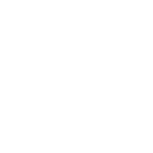
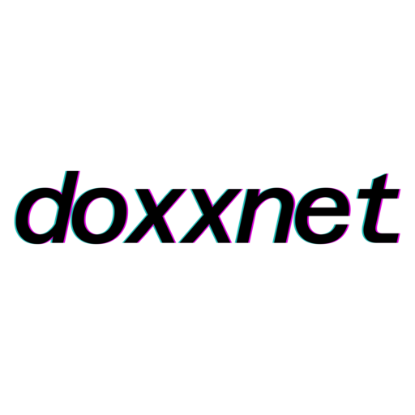
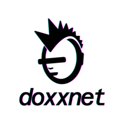
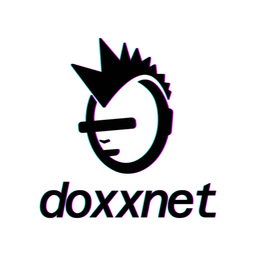

# doxx.net Brand & Style Guide

> **Status:** Active  
> **Last Updated:** 2026-02-07  
> **Brand Guidelines:** MANZO.STUDIO 2026

---

**Copyright (c) 2025-2026 doxx.net corp. All rights reserved.**

DOXXNET, the DOXXNET logo, and the punk isotype are trademarks of doxx.net corp. 
Unauthorized use, reproduction, or distribution of these materials is strictly prohibited.

---

## Brand Concept

The Doxxnet logo represents **resistance against exposure** in a hyper-surveilled digital world.

- **The punk figure** symbolizes rebellion, independence, and defiance toward systems that exploit personal data
- **The line covering the eyes** is a metaphor for anonymity and protection: blocking identification, facial recognition, and unwanted visibility
- **The punk aesthetic** connects to digital counterculture and hacktivism: communities that challenge authority, value privacy, and reject mass surveillance

> *"Privacy is a right, not a privilege."*

---

## App Icon

<p align="center">
  
</p>

| Variant | Background | Path |
|---------|------------|------|
| **Solid Dark** | Dark Blue Grey `#14141E` | [`DarkBlue_gray_background/`](3.%20DIGITAL%20APPLICATIONS/APP%20MOBILE%20ICON/DarkBlue_gray_background/) |
| **Gradient** | Magenta → Teal | [`Gradient_background/`](3.%20DIGITAL%20APPLICATIONS/APP%20MOBILE%20ICON/Gradient_background/) |

---

## Logo Gallery

### Isotype (Punk Symbol)

Use for: App icons, favicons, avatars, watermarks, UI indicators

#### White (for dark backgrounds)

<table>
  <tr>
    <th>64px</th>
    <th>128px</th>
    <th>256px</th>
    <th>512px</th>
  </tr>
  <tr>
    <td align="center" style="background:#111; padding:16px;">
      
    </td>
    <td align="center" style="background:#111; padding:16px;">
      
    </td>
    <td align="center" style="background:#111; padding:16px;">
      
    </td>
    <td align="center" style="background:#111; padding:16px;">
      
    </td>
  </tr>
</table>

<details>
<summary>Click for direct links</summary>

```
# PNG (transparent)
https://raw.githubusercontent.com/doxxcorp/style/main/logo-png/isotype-white/isotype-white-32.png
https://raw.githubusercontent.com/doxxcorp/style/main/logo-png/isotype-white/isotype-white-44.png
https://raw.githubusercontent.com/doxxcorp/style/main/logo-png/isotype-white/isotype-white-64.png
https://raw.githubusercontent.com/doxxcorp/style/main/logo-png/isotype-white/isotype-white-88.png
https://raw.githubusercontent.com/doxxcorp/style/main/logo-png/isotype-white/isotype-white-120.png
https://raw.githubusercontent.com/doxxcorp/style/main/logo-png/isotype-white/isotype-white-128.png
https://raw.githubusercontent.com/doxxcorp/style/main/logo-png/isotype-white/isotype-white-132.png
https://raw.githubusercontent.com/doxxcorp/style/main/logo-png/isotype-white/isotype-white-180.png
https://raw.githubusercontent.com/doxxcorp/style/main/logo-png/isotype-white/isotype-white-256.png
https://raw.githubusercontent.com/doxxcorp/style/main/logo-png/isotype-white/isotype-white-512.png
https://raw.githubusercontent.com/doxxcorp/style/main/logo-png/isotype-white/isotype-white-1024.png

# JPEG (dark background #14141E)
https://raw.githubusercontent.com/doxxcorp/style/main/logo-jpg/isotype-white/isotype-white-256-dark-bg.jpg
https://raw.githubusercontent.com/doxxcorp/style/main/logo-jpg/isotype-white/isotype-white-512-dark-bg.jpg
https://raw.githubusercontent.com/doxxcorp/style/main/logo-jpg/isotype-white/isotype-white-1024-dark-bg.jpg
```

</details>

#### Black (for light backgrounds)

| 64px | 128px | 256px | 512px |
|:----:|:-----:|:-----:|:-----:|
|  |  |  |  |

<details>
<summary>Click for direct links</summary>

```
# PNG (transparent)
https://raw.githubusercontent.com/doxxcorp/style/main/logo-png/isotype-black/isotype-black-32.png
https://raw.githubusercontent.com/doxxcorp/style/main/logo-png/isotype-black/isotype-black-44.png
https://raw.githubusercontent.com/doxxcorp/style/main/logo-png/isotype-black/isotype-black-64.png
https://raw.githubusercontent.com/doxxcorp/style/main/logo-png/isotype-black/isotype-black-88.png
https://raw.githubusercontent.com/doxxcorp/style/main/logo-png/isotype-black/isotype-black-120.png
https://raw.githubusercontent.com/doxxcorp/style/main/logo-png/isotype-black/isotype-black-128.png
https://raw.githubusercontent.com/doxxcorp/style/main/logo-png/isotype-black/isotype-black-132.png
https://raw.githubusercontent.com/doxxcorp/style/main/logo-png/isotype-black/isotype-black-180.png
https://raw.githubusercontent.com/doxxcorp/style/main/logo-png/isotype-black/isotype-black-256.png
https://raw.githubusercontent.com/doxxcorp/style/main/logo-png/isotype-black/isotype-black-512.png
https://raw.githubusercontent.com/doxxcorp/style/main/logo-png/isotype-black/isotype-black-1024.png

# JPEG (light background #F7F7F7)
https://raw.githubusercontent.com/doxxcorp/style/main/logo-jpg/isotype-black/isotype-black-256-light-bg.jpg
https://raw.githubusercontent.com/doxxcorp/style/main/logo-jpg/isotype-black/isotype-black-512-light-bg.jpg
https://raw.githubusercontent.com/doxxcorp/style/main/logo-jpg/isotype-black/isotype-black-1024-light-bg.jpg
```

</details>

#### Color White + Pink + Green (for dark backgrounds)

<table>
  <tr>
    <th>64px</th>
    <th>128px</th>
    <th>256px</th>
    <th>512px</th>
  </tr>
  <tr>
    <td align="center" style="background:#111; padding:24px; height:140px;">
      
    </td>
    <td align="center" style="background:#111; padding:24px; height:140px;">
      
    </td>
    <td align="center" style="background:#111; padding:24px; height:140px;">
      
    </td>
    <td align="center" style="background:#111; padding:24px; height:140px;">
      
    </td>
  </tr>
</table>


<details>
<summary>Click for direct links</summary>

```
# PNG (transparent)
https://raw.githubusercontent.com/doxx/doxx.net-style/main/logo-png/isotype-color-white/isotype-color-white-32.png
https://raw.githubusercontent.com/doxx/doxx.net-style/main/logo-png/isotype-color-white/isotype-color-white-44.png
https://raw.githubusercontent.com/doxx/doxx.net-style/main/logo-png/isotype-color-white/isotype-color-white-64.png
https://raw.githubusercontent.com/doxx/doxx.net-style/main/logo-png/isotype-color-white/isotype-color-white-88.png
https://raw.githubusercontent.com/doxx/doxx.net-style/main/logo-png/isotype-color-white/isotype-color-white-120.png
https://raw.githubusercontent.com/doxx/doxx.net-style/main/logo-png/isotype-color-white/isotype-color-white-128.png
https://raw.githubusercontent.com/doxx/doxx.net-style/main/logo-png/isotype-color-white/isotype-color-white-132.png
https://raw.githubusercontent.com/doxx/doxx.net-style/main/logo-png/isotype-color-white/isotype-color-white-180.png
https://raw.githubusercontent.com/doxx/doxx.net-style/main/logo-png/isotype-color-white/isotype-color-white-256.png
https://raw.githubusercontent.com/doxx/doxx.net-style/main/logo-png/isotype-color-white/isotype-color-white-512.png
https://raw.githubusercontent.com/doxx/doxx.net-style/main/logo-png/isotype-color-white/isotype-color-white-1024.png

# JPEG (dark background #14141E)
https://raw.githubusercontent.com/doxx/doxx.net-style/main/logo-jpg/isotype-color-white/isotype-color-white-256-dark-bg.jpg
https://raw.githubusercontent.com/doxx/doxx.net-style/main/logo-jpg/isotype-color-white/isotype-color-white-512-dark-bg.jpg
https://raw.githubusercontent.com/doxx/doxx.net-style/main/logo-jpg/isotype-color-white/isotype-color-white-1024-dark-bg.jpg
```

</details>

#### Color Black + Pink + Green (for light backgrounds)

| 64px | 128px | 256px | 512px |
|:----:|:-----:|:-----:|:-----:|
|  |  |  |  |

<details>
<summary>Click for direct links</summary>

```
# PNG (transparent)
https://raw.githubusercontent.com/doxx/doxx.net-style/main/logo-png/isotype-color-black/isotype-color-black-32.png
https://raw.githubusercontent.com/doxx/doxx.net-style/main/logo-png/isotype-color-black/isotype-color-black-44.png
https://raw.githubusercontent.com/doxx/doxx.net-style/main/logo-png/isotype-color-black/isotype-color-black-64.png
https://raw.githubusercontent.com/doxx/doxx.net-style/main/logo-png/isotype-color-black/isotype-color-black-88.png
https://raw.githubusercontent.com/doxx/doxx.net-style/main/logo-png/isotype-color-black/isotype-color-black-120.png
https://raw.githubusercontent.com/doxx/doxx.net-style/main/logo-png/isotype-color-black/isotype-color-black-128.png
https://raw.githubusercontent.com/doxx/doxx.net-style/main/logo-png/isotype-color-black/isotype-color-black-132.png
https://raw.githubusercontent.com/doxx/doxx.net-style/main/logo-png/isotype-color-black/isotype-color-black-180.png
https://raw.githubusercontent.com/doxx/doxx.net-style/main/logo-png/isotype-color-black/isotype-color-black-256.png
https://raw.githubusercontent.com/doxx/doxx.net-style/main/logo-png/isotype-color-black/isotype-color-black-512.png
https://raw.githubusercontent.com/doxx/doxx.net-style/main/logo-png/isotype-color-black/isotype-color-black-1024.png

# JPEG (light background #F7F7F7)
https://raw.githubusercontent.com/doxx/doxx.net-style/main/logo-jpg/isotype-color-black/isotype-color-black-256-light-bg.jpg
https://raw.githubusercontent.com/doxx/doxx.net-style/main/logo-jpg/isotype-color-black/isotype-color-black-512-light-bg.jpg
https://raw.githubusercontent.com/doxx/doxx.net-style/main/logo-jpg/isotype-color-black/isotype-color-black-1024-light-bg.jpg
```

</details>

> **Note:** The isotype (punk symbol only) does not contain the text with pink/green accents: these color variants are identical to the solid versions. They are included for naming consistency with the source brand files.

---

### Logotype (Wordmark)

Use for: Navigation bars, headers, editorial layouts, legal documents

#### White (for dark backgrounds)

<table>
  <tr>
    <th>180w</th>
    <th>256w</th>
    <th>512w</th>
  </tr>
  <tr>
    <td align="center" style="background:#111; padding:24px; height:140px;">
      
    </td>
    <td align="center" style="background:#111; padding:24px; height:140px;">
      
    </td>
    <td align="center" style="background:#111; padding:24px; height:140px;">
      
    </td>
  </tr>
</table>


<details>
<summary>Click for direct links</summary>

```
# PNG (transparent)
https://raw.githubusercontent.com/doxxcorp/style/main/logo-png/logotype-white/logotype-white-120w.png
https://raw.githubusercontent.com/doxxcorp/style/main/logo-png/logotype-white/logotype-white-180w.png
https://raw.githubusercontent.com/doxxcorp/style/main/logo-png/logotype-white/logotype-white-256w.png
https://raw.githubusercontent.com/doxxcorp/style/main/logo-png/logotype-white/logotype-white-360w.png
https://raw.githubusercontent.com/doxxcorp/style/main/logo-png/logotype-white/logotype-white-512w.png
https://raw.githubusercontent.com/doxxcorp/style/main/logo-png/logotype-white/logotype-white-720w.png
https://raw.githubusercontent.com/doxxcorp/style/main/logo-png/logotype-white/logotype-white-1024w.png

# JPEG (dark background #14141E)
https://raw.githubusercontent.com/doxxcorp/style/main/logo-jpg/logotype-white/logotype-white-256w-dark-bg.jpg
https://raw.githubusercontent.com/doxxcorp/style/main/logo-jpg/logotype-white/logotype-white-512w-dark-bg.jpg
https://raw.githubusercontent.com/doxxcorp/style/main/logo-jpg/logotype-white/logotype-white-1024w-dark-bg.jpg
```

</details>

#### Black (for light backgrounds)

| 180w | 256w | 512w |
|:----:|:----:|:----:|
|  |  |  |

<details>
<summary>Click for direct links</summary>

```
# PNG (transparent)
https://raw.githubusercontent.com/doxxcorp/style/main/logo-png/logotype-black/logotype-black-120w.png
https://raw.githubusercontent.com/doxxcorp/style/main/logo-png/logotype-black/logotype-black-180w.png
https://raw.githubusercontent.com/doxxcorp/style/main/logo-png/logotype-black/logotype-black-256w.png
https://raw.githubusercontent.com/doxxcorp/style/main/logo-png/logotype-black/logotype-black-360w.png
https://raw.githubusercontent.com/doxxcorp/style/main/logo-png/logotype-black/logotype-black-512w.png
https://raw.githubusercontent.com/doxxcorp/style/main/logo-png/logotype-black/logotype-black-720w.png
https://raw.githubusercontent.com/doxxcorp/style/main/logo-png/logotype-black/logotype-black-1024w.png

# JPEG (light background #F7F7F7)
https://raw.githubusercontent.com/doxxcorp/style/main/logo-jpg/logotype-black/logotype-black-256w-light-bg.jpg
https://raw.githubusercontent.com/doxxcorp/style/main/logo-jpg/logotype-black/logotype-black-512w-light-bg.jpg
https://raw.githubusercontent.com/doxxcorp/style/main/logo-jpg/logotype-black/logotype-black-1024w-light-bg.jpg
```

</details>

#### Color White + Pink + Green (for dark backgrounds)

<table>
  <tr>
    <th>180w</th>
    <th>256w</th>
    <th>512w</th>
  </tr>
  <tr>
    <td align="center" style="background:#111; padding:24px; height:160px;">
      
    </td>
    <td align="center" style="background:#111; padding:24px; height:160px;">
      
    </td>
    <td align="center" style="background:#111; padding:24px; height:160px;">
      
    </td>
  </tr>
</table>


<details>
<summary>Click for direct links</summary>

```
# PNG (transparent)
https://raw.githubusercontent.com/doxx/doxx.net-style/main/logo-png/logotype-color-white/logotype-color-white-120w.png
https://raw.githubusercontent.com/doxx/doxx.net-style/main/logo-png/logotype-color-white/logotype-color-white-180w.png
https://raw.githubusercontent.com/doxx/doxx.net-style/main/logo-png/logotype-color-white/logotype-color-white-256w.png
https://raw.githubusercontent.com/doxx/doxx.net-style/main/logo-png/logotype-color-white/logotype-color-white-360w.png
https://raw.githubusercontent.com/doxx/doxx.net-style/main/logo-png/logotype-color-white/logotype-color-white-512w.png
https://raw.githubusercontent.com/doxx/doxx.net-style/main/logo-png/logotype-color-white/logotype-color-white-720w.png
https://raw.githubusercontent.com/doxx/doxx.net-style/main/logo-png/logotype-color-white/logotype-color-white-1024w.png

# JPEG (dark background #14141E)
https://raw.githubusercontent.com/doxx/doxx.net-style/main/logo-jpg/logotype-color-white/logotype-color-white-256w-dark-bg.jpg
https://raw.githubusercontent.com/doxx/doxx.net-style/main/logo-jpg/logotype-color-white/logotype-color-white-512w-dark-bg.jpg
https://raw.githubusercontent.com/doxx/doxx.net-style/main/logo-jpg/logotype-color-white/logotype-color-white-1024w-dark-bg.jpg
```

</details>

#### Color Black + Pink + Green (for light backgrounds)

| 180w | 256w | 512w |
|:----:|:----:|:----:|
|  |  |  |

<details>
<summary>Click for direct links</summary>

```
# PNG (transparent)
https://raw.githubusercontent.com/doxx/doxx.net-style/main/logo-png/logotype-color-black/logotype-color-black-120w.png
https://raw.githubusercontent.com/doxx/doxx.net-style/main/logo-png/logotype-color-black/logotype-color-black-180w.png
https://raw.githubusercontent.com/doxx/doxx.net-style/main/logo-png/logotype-color-black/logotype-color-black-256w.png
https://raw.githubusercontent.com/doxx/doxx.net-style/main/logo-png/logotype-color-black/logotype-color-black-360w.png
https://raw.githubusercontent.com/doxx/doxx.net-style/main/logo-png/logotype-color-black/logotype-color-black-512w.png
https://raw.githubusercontent.com/doxx/doxx.net-style/main/logo-png/logotype-color-black/logotype-color-black-720w.png
https://raw.githubusercontent.com/doxx/doxx.net-style/main/logo-png/logotype-color-black/logotype-color-black-1024w.png

# JPEG (light background #F7F7F7)
https://raw.githubusercontent.com/doxx/doxx.net-style/main/logo-jpg/logotype-color-black/logotype-color-black-256w-light-bg.jpg
https://raw.githubusercontent.com/doxx/doxx.net-style/main/logo-jpg/logotype-color-black/logotype-color-black-512w-light-bg.jpg
https://raw.githubusercontent.com/doxx/doxx.net-style/main/logo-jpg/logotype-color-black/logotype-color-black-1024w-light-bg.jpg
```

</details>

---

### Imagotype (Full Logo)

Use for: Website headers, presentations, marketing materials, print

#### White (for dark backgrounds)

<table>
  <tr>
    <th>256px</th>
    <th>512px</th>
  </tr>
  <tr>
    <td align="center" style="background:#111; padding:24px; height:180px;">
      
    </td>
    <td align="center" style="background:#111; padding:24px; height:180px;">
      
    </td>
  </tr>
</table>


<details>
<summary>Click for direct links</summary>

```
# PNG (transparent)
https://raw.githubusercontent.com/doxxcorp/style/main/logo-png/imagotype-white/imagotype-white-180.png
https://raw.githubusercontent.com/doxxcorp/style/main/logo-png/imagotype-white/imagotype-white-256.png
https://raw.githubusercontent.com/doxxcorp/style/main/logo-png/imagotype-white/imagotype-white-360.png
https://raw.githubusercontent.com/doxxcorp/style/main/logo-png/imagotype-white/imagotype-white-512.png
https://raw.githubusercontent.com/doxxcorp/style/main/logo-png/imagotype-white/imagotype-white-720.png
https://raw.githubusercontent.com/doxxcorp/style/main/logo-png/imagotype-white/imagotype-white-1024.png

# JPEG (dark background #14141E)
https://raw.githubusercontent.com/doxxcorp/style/main/logo-jpg/imagotype-white/imagotype-white-256-dark-bg.jpg
https://raw.githubusercontent.com/doxxcorp/style/main/logo-jpg/imagotype-white/imagotype-white-512-dark-bg.jpg
https://raw.githubusercontent.com/doxxcorp/style/main/logo-jpg/imagotype-white/imagotype-white-1024-dark-bg.jpg
```

</details>

#### Black (for light backgrounds)

| 256px | 512px |
|:-----:|:-----:|
|  |  |

<details>
<summary>Click for direct links</summary>

```
# PNG (transparent)
https://raw.githubusercontent.com/doxxcorp/style/main/logo-png/imagotype-black/imagotype-black-180.png
https://raw.githubusercontent.com/doxxcorp/style/main/logo-png/imagotype-black/imagotype-black-256.png
https://raw.githubusercontent.com/doxxcorp/style/main/logo-png/imagotype-black/imagotype-black-360.png
https://raw.githubusercontent.com/doxxcorp/style/main/logo-png/imagotype-black/imagotype-black-512.png
https://raw.githubusercontent.com/doxxcorp/style/main/logo-png/imagotype-black/imagotype-black-720.png
https://raw.githubusercontent.com/doxxcorp/style/main/logo-png/imagotype-black/imagotype-black-1024.png

# JPEG (light background #F7F7F7)
https://raw.githubusercontent.com/doxxcorp/style/main/logo-jpg/imagotype-black/imagotype-black-256-light-bg.jpg
https://raw.githubusercontent.com/doxxcorp/style/main/logo-jpg/imagotype-black/imagotype-black-512-light-bg.jpg
https://raw.githubusercontent.com/doxxcorp/style/main/logo-jpg/imagotype-black/imagotype-black-1024-light-bg.jpg
```

</details>

#### Color White + Pink + Green (for dark backgrounds)

<table>
  <tr>
    <th>256px</th>
    <th>512px</th>
  </tr>
  <tr>
    <td align="center" style="background:#111; padding:24px; height:180px;">
      
    </td>
    <td align="center" style="background:#111; padding:24px; height:180px;">
      
    </td>
  </tr>
</table>


<details>
<summary>Click for direct links</summary>

```
# PNG (transparent)
https://raw.githubusercontent.com/doxx/doxx.net-style/main/logo-png/imagotype-color-white/imagotype-color-white-180.png
https://raw.githubusercontent.com/doxx/doxx.net-style/main/logo-png/imagotype-color-white/imagotype-color-white-256.png
https://raw.githubusercontent.com/doxx/doxx.net-style/main/logo-png/imagotype-color-white/imagotype-color-white-360.png
https://raw.githubusercontent.com/doxx/doxx.net-style/main/logo-png/imagotype-color-white/imagotype-color-white-512.png
https://raw.githubusercontent.com/doxx/doxx.net-style/main/logo-png/imagotype-color-white/imagotype-color-white-720.png
https://raw.githubusercontent.com/doxx/doxx.net-style/main/logo-png/imagotype-color-white/imagotype-color-white-1024.png

# JPEG (dark background #14141E)
https://raw.githubusercontent.com/doxx/doxx.net-style/main/logo-jpg/imagotype-color-white/imagotype-color-white-256-dark-bg.jpg
https://raw.githubusercontent.com/doxx/doxx.net-style/main/logo-jpg/imagotype-color-white/imagotype-color-white-512-dark-bg.jpg
https://raw.githubusercontent.com/doxx/doxx.net-style/main/logo-jpg/imagotype-color-white/imagotype-color-white-1024-dark-bg.jpg
```

</details>

#### Color Black + Pink + Green (for light backgrounds)

| 256px | 512px |
|:-----:|:-----:|
|  |  |

<details>
<summary>Click for direct links</summary>

```
# PNG (transparent)
https://raw.githubusercontent.com/doxx/doxx.net-style/main/logo-png/imagotype-color-black/imagotype-color-black-180.png
https://raw.githubusercontent.com/doxx/doxx.net-style/main/logo-png/imagotype-color-black/imagotype-color-black-256.png
https://raw.githubusercontent.com/doxx/doxx.net-style/main/logo-png/imagotype-color-black/imagotype-color-black-360.png
https://raw.githubusercontent.com/doxx/doxx.net-style/main/logo-png/imagotype-color-black/imagotype-color-black-512.png
https://raw.githubusercontent.com/doxx/doxx.net-style/main/logo-png/imagotype-color-black/imagotype-color-black-720.png
https://raw.githubusercontent.com/doxx/doxx.net-style/main/logo-png/imagotype-color-black/imagotype-color-black-1024.png

# JPEG (light background #F7F7F7)
https://raw.githubusercontent.com/doxx/doxx.net-style/main/logo-jpg/imagotype-color-black/imagotype-color-black-256-light-bg.jpg
https://raw.githubusercontent.com/doxx/doxx.net-style/main/logo-jpg/imagotype-color-black/imagotype-color-black-512-light-bg.jpg
https://raw.githubusercontent.com/doxx/doxx.net-style/main/logo-jpg/imagotype-color-black/imagotype-color-black-1024-light-bg.jpg
```

</details>

---

### Favicon (Gradient Background)

Generated from the gradient app icon (`3. DIGITAL APPLICATIONS/APP MOBILE ICON/Gradient_background/PROFILE_IMAGE_X.jpg`). Use for website favicons, browser tabs, and PWA icons.

| Size | Preview | Path | Usage |
|------|---------|------|-------|
| **favicon.ico** |  | `logo-png/favicon/favicon.ico` | Browser tab (multi-res: 16, 32, 48) |
| **16px** | | `logo-png/favicon/favicon-16.png` | Smallest browser tab |
| **32px** |  | `logo-png/favicon/favicon-32.png` | Standard browser tab |
| **48px** | | `logo-png/favicon/favicon-48.png` | High-DPI browser tab |
| **64px** | | `logo-png/favicon/favicon-64.png` | Windows site icon |
| **128px** | | `logo-png/favicon/favicon-128.png` | Chrome Web Store |
| **180px** | | `logo-png/favicon/favicon-180.png` | Apple touch icon |
| **192px** | | `logo-png/favicon/favicon-192.png` | Android home screen |
| **256px** | | `logo-png/favicon/favicon-256.png` | Large icon |
| **512px** | | `logo-png/favicon/favicon-512.png` | PWA splash / Open Graph |

**HTML usage:**
```html
<link rel="icon" href="favicon.ico" sizes="any">
<link rel="icon" type="image/png" sizes="32x32" href="assets/img/favicon-32.png">
<link rel="icon" type="image/png" sizes="192x192" href="assets/img/favicon-192.png">
<link rel="apple-touch-icon" sizes="180x180" href="assets/img/favicon-180.png">
```

---

### iOS/Swift Assets

Drop directly into Xcode Assets.xcassets:

<table>
  <tr>
    <th align="left">Asset</th>
    <th align="center">Preview</th>
    <th align="left">Path</th>
  </tr>
  <tr>
    <td><strong>AppIcon</strong></td>
    <td align="center" style="background:#111; padding:24px; height:140px;">
      
    </td>
    <td><code>logo-swift/AppIcon.appiconset/</code></td>
  </tr>
  <tr>
    <td><strong>Isotype</strong></td>
    <td align="center" style="background:#111; padding:24px; height:140px;">
      
    </td>
    <td><code>logo-swift/Isotype.imageset/</code></td>
  </tr>
  <tr>
    <td><strong>Logotype</strong></td>
    <td align="center" style="background:#111; padding:24px; height:140px;">
      
    </td>
    <td><code>logo-swift/Logotype.imageset/</code></td>
  </tr>
  <tr>
    <td><strong>Imagotype</strong></td>
    <td align="center" style="background:#111; padding:24px; height:160px;">
      
    </td>
    <td><code>logo-swift/Imagotype.imageset/</code></td>
  </tr>
</table>


---

### Typeface

**Acumin Variable Concept - Wide**

Font file: [`3. FONTS/AcuminVariableConcept.otf`](3.%20FONTS/AcuminVariableConcept.otf)

| Weight | Sample | Usage |
|--------|--------|-------|
| **800 Semibold** | **DOXXNET** | Titles, Headlines |
| **400 Regular** | DOXXNET | Subtitles, UI Labels |
| **300 Light** | DOXXNET | Body text, descriptions |

---

## 1.0 Logo System

### Logo Types

| Type | Description | Use Case |
|------|-------------|----------|
| **Imagotype** | Isotype + Logotype combined | Primary: headers, presentations, marketing, print |
| **Logotype** | Wordmark only ("doxxnet") | Editorial, nav bars, legal docs, minimal UI |
| **Isotype** | Punk symbol only | App icons, favicons, avatars, watermarks |
| **Alternate** | Horizontal (isotype left of logotype) | Banners, social covers, limited vertical space |

### Minimum Reproduction Sizes

| Logo Type | Digital | Print |
|-----------|---------|-------|
| Logotype | 120px width | 30mm width |
| Imagotype | 180px width | 60mm width |
| Isotype | 32×32px | 12×12mm |

### Clear Space (Security Space)

| Logo Type | Clear Space |
|-----------|-------------|
| Logotype | 2X on all sides |
| Imagotype | 1.5X on all sides |
| Isotype | (centered in bounding box) |

*Where X = ½ height of the uppercase letter "O" in the logotype*

### Logo Color Usage

| Background | Logo Color |
|------------|------------|
| Dark backgrounds | White logo (Primary Usage) |
| Light backgrounds | Black logo |
| Gradient backgrounds | White logo |
| Single-color applications | Monochrome (white or black) |

### Prohibited Uses

1. Do not stretch, compress, or distort proportions
2. Do not rotate, skew, or flip
3. Do not change colors outside approved palette
4. Do not apply gradients, shadows, glows, or effects
5. Do not place on low-contrast or busy backgrounds
6. Do not modify typography, spacing, or proportions
7. Do not outline, crop, or mask
8. Do not place inside unapproved shapes or containers

---

## 2.0 Color System

### 2.1 Brand Colors (Official from Brand Guidelines)

These are the canonical brand colors from MANZO.STUDIO:

| Color | Name | HEX | RGB | CMYK | Purpose |
|-------|------|-----|-----|------|---------|
|  | Dark Blue Grey | `#14141E` | 20, 20, 30 | 92, 83, 54, 78 | Primary background |
|  | Signal White | `#F7F7F7` | 237, 237, 237 | 8, 6, 7, 0 | Primary foreground |
|  | Neon Green | `#5BBDBA` | 91, 189, 186 | 70, 0, 34, 0 | CTAs, system indicators |
|  | Mexican Pink | `#C82AD3` | 200, 42, 211 | 47, 82, 0, 0 | Energy, identity, bold expression |

### 2.2 Neutral Support Colors

| Color | Name | HEX | RGB | Purpose |
|-------|------|-----|-----|---------|
|  | Graphite Gray | `#9B9B9B` | 155, 155, 155 | Panels, cards, dividers |
|  | Steel Gray | `#D3D3D3` | 211, 211, 211 | Borders, secondary text, placeholders |

### 2.3 Tertiary Color Palette (Mobile Activation)

| Color | HEX | RGB | Usage |
|-------|-----|-----|-------|
|  | `#B9D730` | 185, 215, 48 | Hover/focus states |
|  | `#F68D0B` | 91, 189, 186 | Active states |
|  | `#57B7ED` | 87, 183, 237 | Selected items |
|  | `#7949A7` | 121, 73, 167 | Toggle backgrounds |
|  | `#F8D8A5` | 248, 216, 165 | Progress indicators |
|  | `#AA87D1` | 170, 135, 209 | Tab selection |
|  | `#D92E29` | 217, 46, 41 | Error/destructive |
|  | `#ABCDEA` | 171, 205, 234 | Info states |
|  | `#4D4D5A` | 77, 77, 90 | Inactive/disabled |
|  | `#F5C122` | 245, 193, 34 | Warning/caution |

### 2.4 Color Hierarchy Rules

| Palette | Role | Usage % (Web) | Usage % (Mobile) |
|---------|------|---------------|------------------|
| Primary | Brand foundation | 65-70% | 60-65% |
| Secondary | Action & expression | 10-15% | 12-18% |
| Tertiary | System & support | 5-8% | 8-12% |
| Gradients | Backgrounds only | 8-12% | 10-15% |

---

## 3.0 App Implementation Colors

> **Note:** The app uses slightly adjusted colors optimized for screen rendering. These differ from brand guidelines but are approved for digital products.

### Background

| Color | Name | HEX | Swift | CSS |
|-------|------|-----|-------|-----|
|  | Dark | `#14141F` | `doxxDarkBackground` | `--bg-dark` |

### Accent Colors

| Color | Name | HEX | Swift | CSS | Usage |
|-------|------|-----|-------|-----|-------|
|  | Magenta | `#DB00DB` | `doxxAccentMagenta` | `--accent-magenta` | Primary CTA, brand borders |
|  | Teal | `#1BC1BC` | `doxxAccentTeal` | `--accent-teal` | Secondary, success, active |
|  | Red | `#FF4D6A` | `doxxAccentRed` | `--accent-red` | Error, destructive, warnings, caution boxes |
|  | Yellow | `#FFD54F` | `doxxAccentYellow` | `--accent-yellow` | Latency indicators, beta badges, LAN labels |

### Text Hierarchy

| Color | Name | HEX | Swift | CSS | Usage |
|-------|------|-----|-------|-----|-------|
|  | Primary | `#FFFFFF` | `doxxTextPrimary` | `--text-primary` | Headings, labels |
|  | Secondary | `#D1C7FF` | `doxxTextSecondary` | `--text-secondary` | Body, links |
|  | Tertiary | `#9A91C8` | `doxxTextTertiary` | `--text-tertiary` | Captions, hints |

### Main Gradient

| Color | Name | HEX | Swift | Position |
|-------|------|-----|-------|----------|
|  | Start | `#667EEA` | `doxxTileGradientStart` | Top-left |
|  | End | `#764BA2` | `doxxTileGradientEnd` | Bottom-right |

**CSS:** `background: linear-gradient(135deg, #667EEA 0%, #764BA2 100%);`

### Icon Colors

| Color | Name | HEX | Swift | Usage |
|-------|------|-----|-------|-------|
|  | Toolbar | `#FFFFFF` | `.white` | NOT accent colors |
|  | Status (active) | `#1BC1BC` | `doxxAccentTeal` | Filled indicators |
|  | Status (empty) | `#333333` | `.white.opacity(0.2)` | Unfilled states |

### Icon Interactive States

Icons change color based on whether they are interactive (tappable/clickable) or display-only:

| State | Color | Swift | Usage |
|-------|-------|-------|-------|
| **Non-interactive (default)** | Teal `#1BC1BC` | `.doxxAccentTeal` | Display-only icons, informational indicators, section headers, static labels |
| **Interactive (tapped/clicked)** | White `#FFFFFF` | `.white` | Buttons, tappable rows, active selections, toolbar actions |

**Rule:** If an icon is purely decorative or informational (not tappable), it must use `doxxAccentTeal`. Only icons that respond to user interaction (tap, press, click) should use white. This creates a clear visual distinction between "this is information" (teal) and "this is actionable" (white).

```swift
// Display-only icon (settings section header, policy description, etc.)
Image(systemName: "key.horizontal.fill")
    .foregroundColor(.doxxAccentTeal)

// Interactive icon (toolbar button, tappable row, etc.)
Image(systemName: "arrow.clockwise")
    .foregroundColor(.white)
```

### Borders

| Color | Name | HEX | Swift | CSS | Usage |
|-------|------|-----|-------|-----|-------|
|  | Focus | `#DB00DB` | `doxxBorderMagenta` | `--border-focus` | Highlighted elements |
|  | Subtle | `#262626` | `doxxBorderWhiteSubtle` | `--border-subtle` | Dividers |

---

## 4.0 Charts & Graphs

Colors used in security dashboards, bandwidth graphs, and data visualizations.

### Bandwidth Color Pairs (Multi-Tunnel Visualization)

Retro-inspired color pairs for download/upload visualization:

| Color | Name | Hex (In) | Hex (Out) | Usage |
|-------|------|----------|-----------|-------|
|   | Pink/Cyan | `#ff71ce` | `#01cdfe` | Tunnel 1 |
|   | Green/Purple | `#05ffa1` | `#b967ff` | Tunnel 2 |
|   | Yellow/Orange | `#fffb96` | `#ff9e7a` | Tunnel 3 |
|   | Aqua/Pink | `#01ffff` | `#ff1493` | Tunnel 4 |

### Bandwidth Gauges

| Color | Name | HEX | CSS | Usage |
|-------|------|-----|-----|-------|
|  | Download | `#00ffaa` | `--gauge-download` | Download speed |
|  | Upload | `#00ff00` | `--gauge-upload` | Upload speed |

### Latency Colors

Discrete color bands for ICMP ping visualization (teal → yellow → red progression):

| Color | Name | HEX | Swift | Latency Range |
|-------|------|-----|-------|---------------|
|  | Bright Teal | `#4DFFF8` | `latencyBrightTeal` | < 50ms |
|  | Teal | `#1BC1BC` | `doxxAccentTeal` | 50-100ms |
|  | Yellow | `#FFD54F` | `doxxAccentYellow` | 100-150ms |
|  | Red | `#FF4D6A` | `doxxAccentRed` | > 300ms |

*Note: 150-300ms range transitions smoothly from yellow to red.*

**Bright Teal** (`#4DFFF8`) is also used for:
- IPv6/DNS/Quantum verification flash animations
- Status indicator "pop" effect on successful checks

### Jitter Colors

| Color | Name | HEX | Jitter Range |
|-------|------|-----|--------------|
|  | Teal | `#1BC1BC` | < 15ms |
|  | Yellow | `#FFD54F` | 15-30ms |
|  | Red | `#FF4D6A` | > 30ms |

### Terminal Style

Retro terminal/matrix aesthetic used in security console, status pages, and real-time event feeds. Dark near-black background with phosphor-green accents, rounded containers with green-tinted borders.

| Color | Name | HEX / Value | CSS | Usage |
|-------|------|-------------|-----|-------|
|  | Terminal Green | `#00ff00` | `--terminal-green` | Primary text, borders, status |
|  | Terminal BG | `#0a0a0f` | `--terminal-bg` | Near-black chart/console background |
| | Terminal Border | `rgba(0, 255, 0, 0.3)` | `--terminal-border` | Container borders (green-tinted) |
| | Terminal Dim | `rgba(0, 255, 0, 0.6)` | `--terminal-dim` | Section headers, muted labels |
| | Terminal Faint | `rgba(0, 255, 0, 0.05)` | `--terminal-faint` | Canvas grid fill, hover rows |
| | Terminal Grid | `rgba(0, 255, 0, 0.1)` | `--terminal-grid` | Grid lines, subtle separators |
|  | Timestamp | `#80a1ad` | `--terminal-timestamp` | Timestamps in event feeds |

**Terminal Container Pattern:**
- Background: `--terminal-bg` (`#0a0a0f`)
- Border: `1px solid` `--terminal-border` (`rgba(0, 255, 0, 0.3)`)
- Border Radius: `12px` (rounded)
- Box Shadow: `0 0 20px rgba(0, 255, 0, 0.2)` (green glow)
- Font: `--font-mono` (JetBrains Mono)

### Status Indicators

Universal status colors for tunnel state, server heartbeats, and connection health.

| Color | Name | HEX | CSS | Usage |
|-------|------|-----|-----|-------|
|  | Online | `#4caf50` | `--status-online` | Active tunnels, connected servers |
|  | Offline | `#9b9b9b` | `--status-offline` | Inactive tunnels, unresponsive servers |
|  | Sleeping | `#f68d0b` | `--status-sleeping` | Idle tunnels (no recent traffic) |
|  | Error | `#ff4d6a` | `--status-error` | Down links, failed connections |
|  | Unknown | `#f5c122` | `--status-unknown` | Unexpected servers, unresolved state |

### Security Event Categories

Colors for security dashboard category pills and event counters.

| Color | Name | HEX | CSS | Category |
|-------|------|-----|-----|----------|
|  | Ads | `#ff4d6a` | `--cat-ads` | Ad/tracker DNS blocks |
|  | Tracking | `#14b8a6` | `--cat-tracking` | Tracking & analytics DNS blocks |
|  | Phishing | `#ec4899` | `--cat-phishing` | Phishing domain blocks |
|  | Adult | `#a855f7` | `--cat-adult` | Adult content DNS blocks |
|  | Social | `#84cc16` | `--cat-social` | Social media DNS blocks |
|  | Malware | `#f68d0b` | `--cat-malware` | Malware domain blocks |
|  | Port Scans | `#7949a7` | `--cat-port-scans` | Port scanning detection |
|  | Exploits | `#d92e29` | `--cat-exploits` | Exploit attempts |
|  | DNS Bypass | `#f5c122` | `--cat-dns-bypass` | DoH/DoT bypass attempts |
|  | DNSSEC | `#57b7ed` | `--cat-dnssec` | DNSSEC validation failures |
|  | Other | `#9b9b9b` | `--cat-other` | Uncategorized events |

### Topology

Colors for network topology visualization (backbone mesh, tunnel maps).

| Color | Name | HEX | CSS | Usage |
|-------|------|-----|-----|-------|
|  | Cloud | `#667eea` | `--topo-cloud` | Central cloud node, gradient start |
|  | Cloud End | `#764ba2` | `--topo-cloud-end` | Background gradient end |
|  | Backbone Link | `#d1c7ff` | `--topo-backbone-link` | Inter-site backbone connections |
|  | Tunnel Link | `#01cdfe` | `--topo-tunnel-link` | Tunnel-to-location connections |

**Topology Gradient:** `linear-gradient(135deg, #667eea 0%, #764ba2 100%)` — used for mesh page backgrounds and CTA buttons within topology views.

---

## 5.0 Typography System

### Typeface

**Acumin Variable Concept - Wide**

DOXXNET uses Acumin Variable Concept – Wide to express digital authority, structural precision, and controlled rebellion.

### Typeface Roles

| Weight | Name | Usage |
|--------|------|-------|
| **800** | Wide Semibold | Titles, Headlines, Major statements |
| **400** | Wide | Subtitles, Section Headers, UI Labels |
| **300** | Wide Light | Body text, descriptions, metadata |

### Typography Hierarchy

| Level | Font | Weight | Size (Desktop) | Size (Mobile) | Line Height | Letter Spacing | Color |
|-------|------|--------|----------------|---------------|-------------|----------------|-------|
| H1 | Acumin Wide | 800 | 54-72px | 36-40px | 95-105% | -0.05em | `#EDEDED` |
| H2 | Acumin Wide | 800 | 40-48px | 30-36px | 110-115% | -0.006em | `#EDEDED` |
| H3 | Acumin Wide | 400 | 24-32px | 20-24px | 120% | 0.02em | `#EDEDED` |
| Subtitle | Acumin Wide | 400 | 18-22px | 16-18px | 140-150% | 0-0.005em | `#EDEDED` |
| Body | Acumin Wide | 300 | 14-16px | 14-16px | 150-160% | 0.0005em | `#EDEDED` |
| Caption | Acumin Wide | 400 | 10-13px | 10-13px | 120-140% | 0.03-0.05em | `#EDEDED` |

**Rules:**
- Avoid ALL CAPS except for H2 section titles
- Never use uppercase for body paragraphs
- Uppercase improves clarity at small sizes (captions, labels)

---

## 6.0 Button System

### Button Hierarchy

| Type | Color | Usage |
|------|-------|-------|
| Primary CTA | Magenta `#DB00DB` | Main actions: Connect, Subscribe, Explore |
| Secondary | Teal `#1BC1BC` | In-progress, secondary actions |
| Tertiary/Ghost | Transparent | Text buttons, less prominent actions |
| Destructive | Red `#FF4D6A` | Delete, disconnect, critical actions |

### Button Specifications

| Property | Value |
|----------|-------|
| Corner Radius | 16pt (iOS) / 12px (Web) |
| Height | 56pt (iOS) |
| Text | `.headline`, `.semibold`, white |
| Border | 1.5pt gradient stroke (accent @ 90% → 50%) |
| Shadow | Accent color @ 30%, radius 8, y-offset 4 |

### Glass Effect Layers (bottom to top)

1. Linear gradient: `accent @ 50%` → `accent @ 30%` → `black @ 40%`
2. Glass highlight: `white @ 25%` → `white @ 5%` → `clear`
3. Gradient border stroke

### Glass Effect: Swift Implementation

```swift
// Layer 1: Base fill (accent → accent → black)
RoundedRectangle(cornerRadius: 16)
    .fill(
        LinearGradient(
            colors: [
                Color.doxxAccentMagenta.opacity(0.5),
                Color.doxxAccentMagenta.opacity(0.3),
                Color.black.opacity(0.4)
            ],
            startPoint: .top,
            endPoint: .bottom
        )
    )

// Layer 2: Glass highlight (white reflection, top to center)
RoundedRectangle(cornerRadius: 16)
    .fill(
        LinearGradient(
            colors: [
                Color.white.opacity(0.25),
                Color.white.opacity(0.05),
                Color.clear
            ],
            startPoint: .top,
            endPoint: .center
        )
    )

// Layer 3: Gradient border stroke
RoundedRectangle(cornerRadius: 16)
    .strokeBorder(
        LinearGradient(
            colors: [
                accentColor.opacity(0.9),
                accentColor.opacity(0.5)
            ],
            startPoint: .top,
            endPoint: .bottom
        ),
        lineWidth: 1.5
    )

// Shadow
.shadow(color: accentColor.opacity(0.3), radius: 8, x: 0, y: 4)
```

### Glass Effect: CSS Implementation

```css
.doxx-btn-primary {
    position: relative;
    display: inline-flex;
    align-items: center;
    justify-content: center;
    height: 56px;
    padding: 0 24px;
    font-weight: 600;
    font-size: 17px;
    color: #FFFFFF;
    border: none;
    border-radius: 12px;
    overflow: hidden;
    cursor: pointer;
    /* Layer 1: Base fill */
    background: linear-gradient(to bottom,
        rgba(219,0,219,0.5) 0%,
        rgba(219,0,219,0.3) 50%,
        rgba(0,0,0,0.4) 100%);
    /* Shadow */
    box-shadow: 0 4px 8px rgba(219,0,219,0.3);
    transition: transform 0.15s ease, box-shadow 0.25s ease;
}

/* Layer 3: Gradient border stroke (1.5px) */
.doxx-btn-primary::before {
    content: '';
    position: absolute;
    inset: 0;
    border-radius: 12px;
    padding: 1.5px;
    background: linear-gradient(to bottom,
        rgba(219,0,219,0.9),
        rgba(219,0,219,0.5));
    -webkit-mask:
        linear-gradient(#fff 0 0) content-box,
        linear-gradient(#fff 0 0);
    -webkit-mask-composite: xor;
    mask-composite: exclude;
    pointer-events: none;
}

/* Layer 2: Glass highlight */
.doxx-btn-primary::after {
    content: '';
    position: absolute;
    inset: 1.5px;
    border-radius: 10.5px;
    background: linear-gradient(to bottom,
        rgba(255,255,255,0.25) 0%,
        rgba(255,255,255,0.05) 45%,
        transparent 55%);
    pointer-events: none;
}

/* Hover: lift + stronger shadow */
.doxx-btn-primary:hover {
    transform: translateY(-1px);
    box-shadow: 0 6px 16px rgba(219,0,219,0.4);
}

/* Active: press scale (matches iOS 0.98) */
.doxx-btn-primary:active {
    transform: scale(0.98);
    box-shadow: 0 3px 6px rgba(219,0,219,0.3);
}
```

### Button Variants: Accent Color Substitution

Replace `doxxAccentMagenta` / `#DB00DB` with the variant's accent color:

| Variant | Accent Color | Usage |
|---------|-------------|-------|
| Primary | `#DB00DB` (Magenta) | Connect, Subscribe, main CTAs |
| Secondary | `#1BC1BC` (Teal) | In-progress, secondary actions |
| Destructive | `#FF4D6A` (Red) | Delete, disconnect |

---

## 6.1 App Icon Style

The app icon uses the **isotype (punk symbol)** rendered in white monochrome on a rounded rectangle with specific background and padding treatments.

### Primary Usage: White Logo on Dark Backgrounds

| Variant | Background | Usage |
|---------|------------|-------|
| **Solid Dark** | Dark Blue Grey `#14141E` | Default app icon, App Store, home screen |
| **Gradient** | Magenta `#C82AD3` → Teal `#5BBDBA` (diagonal) | Social profiles, marketing, featured placements |

### App Icon Specifications

| Property | Value |
|----------|-------|
| Logo Color | White monochrome (no glitch effect) |
| Corner Radius | iOS system radius (continuous curve) |
| Logo Padding | ~22% inset from edges |
| Logo Position | Centered vertically and horizontally |

### Gradient Background Specs

| Property | Value |
|----------|-------|
| Type | Linear gradient |
| Angle | ~135° (top-left to bottom-right) |
| Start Color | Mexican Pink `#C82AD3` (top-left) |
| End Color | Neon Green `#5BBDBA` (bottom-right) |

### App Icon Assets

| Asset | Path | Background |
|-------|------|------------|
| Solid Dark | `3. DIGITAL APPLICATIONS/APP MOBILE ICON/DarkBlue_gray_background/` | `#14141E` |
| Gradient | `3. DIGITAL APPLICATIONS/APP MOBILE ICON/Gradient_background/` | Magenta→Teal |
| Xcode Ready | `logo-swift/AppIcon.appiconset/` | Gradient (1024×1024) |

### Rules

- App icons always use **solid white monochrome** isotype: never the glitch/anaglyphic treatment
- The glitch effect (cyan + magenta offset) is reserved for **marketing materials, web, and print**: not app icons
- Never place the full imagotype (icon + text) inside an app icon frame

---

## 7.0 Icons and Emojis

**NEVER EVER USE A SHIELD.** The shield icon/emoji is overused in security/VPN apps and feels generic. Use alternative icons that convey the same meaning without the cliché.

### Warning & Caution Boxes

**Use `doxxAccentRed` (#FF4D6A) for all warning, caution, and responsible-use notices.** Do NOT use yellow, brown, amber, or orange for warnings. The yellow accent (`doxxAccentYellow`) is reserved for latency indicators, beta badges, and LAN status labels only.

**Use the custom `settings_caution` icon** (from the database-driven icon system) for warning boxes. Do NOT use SF Symbol emoji like `exclamationmark.triangle.fill` or any system caution emoji. Our icon system exists for a reason: use it.

| Element | Value | Swift |
|---------|-------|-------|
| **Icon** | `settings_caution` (PNG from icon system) | `Image("settings_caution").renderingMode(.original)` |
| **Background** | Red @ 10% opacity | `Color.doxxAccentRed.opacity(0.1)` |
| **Border** | Red @ 30% opacity, 1pt | `.stroke(Color.doxxAccentRed.opacity(0.3), lineWidth: 1)` |
| **Title** | White, `.headline` | `.foregroundColor(.white)` |
| **Body text** | Secondary | `.foregroundColor(.doxxTextSecondary)` |
| **Corner radius** | 12pt | `.cornerRadius(12)` |

```swift
// WARNING BOX: Standard pattern for all caution/warning/responsible-use notices
VStack(alignment: .leading, spacing: 8) {
    HStack(spacing: 8) {
        Image("settings_caution")
            .renderingMode(.original)
            .resizable()
            .aspectRatio(contentMode: .fit)
            .frame(width: 24, height: 24)
        Text("Warning Title")
            .font(.headline)
            .foregroundColor(.white)
    }
    Text("Warning body text goes here.")
        .font(.subheadline)
        .foregroundColor(.doxxTextSecondary)
}
.padding(16)
.background(Color.doxxAccentRed.opacity(0.1))
.cornerRadius(12)
.overlay(
    RoundedRectangle(cornerRadius: 12)
        .stroke(Color.doxxAccentRed.opacity(0.3), lineWidth: 1)
)
```

### AI Rules for Icons

1. **Never use SF Symbol emoji as icons** in settings, warning boxes, or section headers. Use the database-driven icon system (`settings_*` or `category_*` assets). See `AI_CONTEXT/UPDATING-ICONS.md` for how to add new icons.
2. **Never use yellow/amber/brown for warnings.** Use `doxxAccentRed`.
3. **Never use a shield icon or emoji** in any context.
4. **Never hardcode icon paths.** All icons come from the `dn_stats_defs` database and are synced via `update-build-data.sh`.

---

## 7.1 Writing Style & Naming Conventions

### Product & Company Names

**The product is `doxx.net`. The brand is `doxxnet`. The company is `doxx.net corp`.**

These are the official forms. Use them consistently across all documentation, code, UI, and marketing.

| Context | Correct | Incorrect |
|---------|---------|-----------|
| Product name (in text) | doxx.net | Doxx.net, DOXX.NET, doxx, Doxx |
| Brand name (logos, titles) | DOXXNET, doxxnet | DoxxNet, Doxx Net, doxx.net (in logos) |
| Company name | doxx.net corp | Doxx.net Corp, DOXX.NET Corp, doxxnet corp |
| iOS app bundle | net.doxx | - |
| GitHub org | doxxcorp | - |
| Code references | `doxx.net`, `doxxnet` | `doxx`, `DOXX` |

### AI Context Rules

When AI assistants (Cursor, Copilot, ChatGPT, etc.) generate documentation, code comments, commit messages, or UI text for doxx.net projects, they must follow these rules:

1. **Product name is `doxx.net`** (lowercase, with dot): use in documentation, READMEs, code comments, error messages, and all prose
2. **Brand name is `doxxnet`** (one word, no dot): use in logos, marketing headlines, Swift/CSS variable prefixes (`doxxAccentTeal`, `doxxDarkBackground`), and brand contexts
3. **Never capitalize as `Doxx.net`** unless starting a sentence, and even then prefer restructuring the sentence to avoid it
4. **Copyright lines use:** `doxx.net corp` (all lowercase)
5. **The punk icon is called the "isotype"**, not "logo", "icon", or "mascot"
6. **The text wordmark is called the "logotype"**, not "text logo" or "brand name"
7. **The combined symbol+text is called the "imagotype"**, not "full logo" or "logo with text"
8. **Never use "VPN"** anywhere (see below)
9. **Never use em dashes** (see below)
10. **Never use a shield icon/emoji** in any context

### No Em Dashes

**Do not use em dashes (`--` or `---`) in documentation, READMEs, or UI text.** Use a colon `:` instead.

| Bad | Good |
|-----|------|
| WireGuard Authentication -- Validates public keys | WireGuard Authentication: Validates public keys |
| Survival mode -- serves from cache | Survival mode: serves from cache |
| Full mesh mode -- all tunnels communicate | Full mesh mode: all tunnels communicate |

### Never Say "VPN"

**Do not use the word "VPN" in any doxx.net documentation, UI, or marketing.** doxx.net is a secure networking platform, not a "VPN service." Use these alternatives:

| Bad | Good |
|-----|------|
| VPN tunnel | tunnel, encrypted tunnel |
| VPN service | network, platform, secure network |
| VPN client | app, client |
| Connect to the VPN | Connect to the network |
| VPN server | server, backbone server |
| VPN provider | doxx.net, the platform |

---

## 8.0 Links & Navigation

| Type | Color | Swift | Usage |
|------|-------|-------|-------|
| Navigation | `#FFFFFF` | `.white` | "< Settings", "< Back" |
| In-page | `#D1C7FF` | `doxxTextSecondary` | Terms, Privacy, Discord |
| Email | `#D1C7FF` | `doxxTextSecondary` | mailto: links |
| External | `#D1C7FF` | `doxxTextSecondary` | Opens browser |

### Official Links

| Link | URL |
|------|-----|
| Discord | https://discord.gg/Gr9rByrEzZ |
| Terms | https://doxx.net/terms |
| Privacy | https://doxx.net/privacy |
| Support Email | support@doxx.net |

---

## 9.0 Developer Quick Reference

### Ready-to-Use Assets

Drop these directly into your Xcode project:

| Asset | Path | Sizes Available |
|-------|------|-----------------|
| **App Icon** | `logo-swift/AppIcon.appiconset/` | 1024×1024 (Xcode generates all sizes) |
| **Isotype** | `logo-swift/Isotype.imageset/` | @1x (44pt), @2x (88pt), @3x (132pt) |
| **Logotype** | `logo-swift/Logotype.imageset/` | @1x (120w), @2x (256w), @3x (360w) |
| **Imagotype** | `logo-swift/Imagotype.imageset/` | @1x (180pt), @2x (360pt), @3x (512pt) |

### PNG Assets (Transparent Background)

All PNGs located in `logo-png/`:

| Folder | Sizes | Use Case |
|--------|-------|----------|
| `isotype-white/` | 32, 44, 64, 88, 120, 128, 132, 180, 256, 512, 1024 | Dark mode, dark backgrounds |
| `isotype-black/` | 32, 44, 64, 88, 120, 128, 132, 180, 256, 512, 1024 | Light mode, light backgrounds |
| `isotype-color-white/` | 32, 44, 64, 88, 120, 128, 132, 180, 256, 512, 1024 | Color variant on dark* |
| `isotype-color-black/` | 32, 44, 64, 88, 120, 128, 132, 180, 256, 512, 1024 | Color variant on light* |
| `logotype-white/` | 120w, 180w, 256w, 360w, 512w, 720w, 1024w | Dark mode text headers |
| `logotype-black/` | 120w, 180w, 256w, 360w, 512w, 720w, 1024w | Light mode text headers |
| `logotype-color-white/` | 120w, 180w, 256w, 360w, 512w, 720w, 1024w | Color (white+pink+green) on dark |
| `logotype-color-black/` | 120w, 180w, 256w, 360w, 512w, 720w, 1024w | Color (black+pink+green) on light |
| `imagotype-white/` | 180, 256, 360, 512, 720, 1024 | Primary logo on dark |
| `imagotype-black/` | 180, 256, 360, 512, 720, 1024 | Primary logo on light |
| `imagotype-color-white/` | 180, 256, 360, 512, 720, 1024 | Color (white+pink+green) on dark |
| `imagotype-color-black/` | 180, 256, 360, 512, 720, 1024 | Color (black+pink+green) on light |

*Isotype color variants are identical to solid: the punk symbol has no text with pink/green accents.*

### JPEG Assets (With Background)

All JPEGs located in `logo-jpg/`:

| Folder | Background | Sizes | Use Case |
|--------|------------|-------|----------|
| `isotype-white/` | Dark Blue Grey (#14141E) | 256, 512, 1024 | Social media, marketing |
| `isotype-black/` | Signal White (#F7F7F7) | 256, 512, 1024 | Print, light backgrounds |
| `isotype-color-white/` | Dark Blue Grey (#14141E) | 256, 512, 1024 | Color variant on dark |
| `isotype-color-black/` | Signal White (#F7F7F7) | 256, 512, 1024 | Color variant on light |
| `logotype-white/` | Dark Blue Grey (#14141E) | 256w, 512w, 1024w | Banners, headers |
| `logotype-black/` | Signal White (#F7F7F7) | 256w, 512w, 1024w | Print materials |
| `logotype-color-white/` | Dark Blue Grey (#14141E) | 256w, 512w, 1024w | Color (white+pink+green) banners |
| `logotype-color-black/` | Signal White (#F7F7F7) | 256w, 512w, 1024w | Color (black+pink+green) print |
| `imagotype-white/` | Dark Blue Grey (#14141E) | 256, 512, 1024 | Primary marketing |
| `imagotype-black/` | Signal White (#F7F7F7) | 256, 512, 1024 | Print, presentations |
| `imagotype-color-white/` | Dark Blue Grey (#14141E) | 256, 512, 1024 | Color (white+pink+green) marketing |
| `imagotype-color-black/` | Signal White (#F7F7F7) | 256, 512, 1024 | Color (black+pink+green) print |

### Common iOS Usage

```swift
// App icon (automatically used from AppIcon.appiconset)

// Isotype (punk symbol) - 44pt base
Image("Isotype")

// Logotype (text only) - 120pt base width  
Image("Logotype")

// Imagotype (symbol + text) - 180pt base
Image("Imagotype")
```

---

## 10.0 File Organization

```
style/
├── logo-png/                   # PNG assets (transparent background)
│   ├── isotype-white/          # 32-1024px
│   ├── isotype-black/          # 32-1024px
│   ├── isotype-color-white/    # 32-1024px (color variant)
│   ├── isotype-color-black/    # 32-1024px (color variant)
│   ├── logotype-white/         # 120w-1024w
│   ├── logotype-black/         # 120w-1024w
│   ├── logotype-color-white/   # 120w-1024w (white+pink+green)
│   ├── logotype-color-black/   # 120w-1024w (black+pink+green)
│   ├── imagotype-white/        # 180-1024px
│   ├── imagotype-black/        # 180-1024px
│   ├── imagotype-color-white/  # 180-1024px (white+pink+green)
│   ├── imagotype-color-black/  # 180-1024px (black+pink+green)
│   └── favicon/                # 16-512px + favicon.ico (gradient background)
├── logo-jpg/                   # JPEG assets (with backgrounds)
│   ├── isotype-white/          # Dark background
│   ├── isotype-black/          # Light background
│   ├── isotype-color-white/    # Dark background (color)
│   ├── isotype-color-black/    # Light background (color)
│   ├── logotype-white/         # Dark background
│   ├── logotype-black/         # Light background
│   ├── logotype-color-white/   # Dark background (color)
│   ├── logotype-color-black/   # Light background (color)
│   ├── imagotype-white/        # Dark background
│   ├── imagotype-black/        # Light background
│   ├── imagotype-color-white/  # Dark background (color)
│   └── imagotype-color-black/  # Light background (color)
├── logo-swift/                 # iOS/Xcode assets
│   ├── AppIcon.appiconset/     # 1024x1024
│   ├── Isotype.imageset/       # @1x, @2x, @3x
│   ├── Logotype.imageset/      # @1x, @2x, @3x
│   └── Imagotype.imageset/     # @1x, @2x, @3x
├── 1. LOGO/                    # Source files (AI, PDF, SVG, PNG)
│   ├── RGB/                    # Digital/screen
│   └── CMYK/                   # Print
├── 2. BRAND GUIDELINES/
│   └── BRAND_GUIDELINES_DEXXNET.pdf
├── 3. DIGITAL APPLICATIONS/    # Social media assets
├── 3. FONTS/
│   └── AcuminVariableConcept.otf
└── README.md
```

### Logo Variants

| Folder Name | Description |
|-------------|-------------|
| WHITE + Pink + Green | White base with accent colors |
| BLACK + Pink + Green | Black base with accent colors |
| WHITE SOLID | Solid white (monochrome) |
| BLACK SOLID | Solid black (monochrome) |
| SOLID WHITE / SOLID BLACK | Alternative naming for monochrome |
| PRINCIPAL | Full color version |
| PRINCIPAL BLANCO | Full color on white |

