# Shared Icons Catalog

> Auto-generated by `scripts/sync-icons.sh`. Do not edit manually.

**Total icons:** 77
- **48** referenced in `stats_definitions.json` (icon_type: image)
- **29** not yet referenced (need API update or are generic/utility icons)

**Columns:**
- **Stats Ref**: whether `stats_definitions.json` has an `icon_image_dark_theme` path pointing to this icon
- **Source**: where the icon file was originally created (`iOS` = from iOS app assets, `style (created)` = SVG created in this repo)

## Dns Block

| Icon | Name | Event Type | Label | Color | Stats Ref | Source |
|------|------|------------|-------|-------|-----------|--------|
|  | `ads` | dns_block.ads | Advertisements |  | yes | iOS |
| 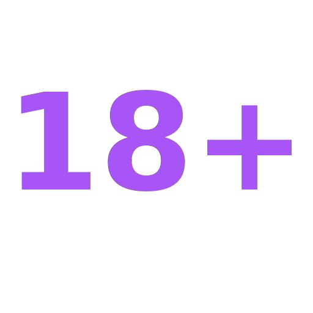 | `adult` | dns_block.adult | Adult Content |  | no (emoji) | style (created) |
|  | `content` |  |  |  | no | style (created) |
|  | `fakenews` | dns_block.fakenews | Fake News |  | no (emoji) | style (created) |
| 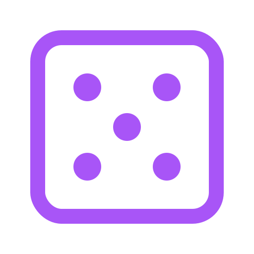 | `gambling` | dns_block.gambling | Gambling |  | no (emoji) | style (created) |
| 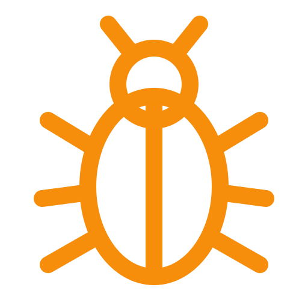 | `malware` | dns_block.malware | Malware |  | no (emoji) | style (created) |
| 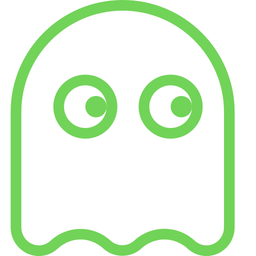 | `mixed-gen` | dns_block.mixed | Mixed/General |  | yes | iOS |
|  | `mixed-gen-120` |  |  |  | no | iOS |
|  | `mixed-gen-40` |  |  |  | no | iOS |
|  | `mixed-gen-480` |  |  |  | no | iOS |
|  | `phishing` | dns_block.phishing | Phishing |  | yes | iOS |
| 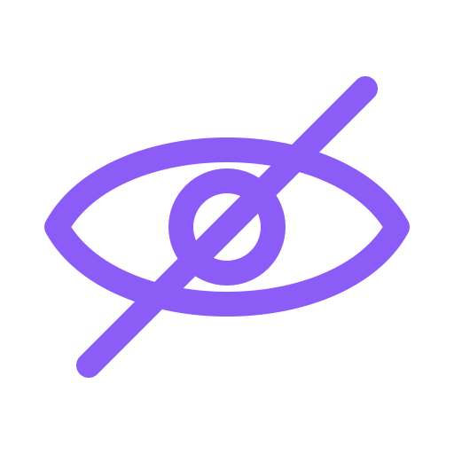 | `privacy` |  |  |  | no | style (created) |
| 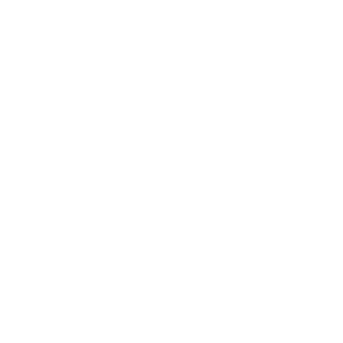 | `security` | dns_block.security | Security |  | yes | iOS |
| 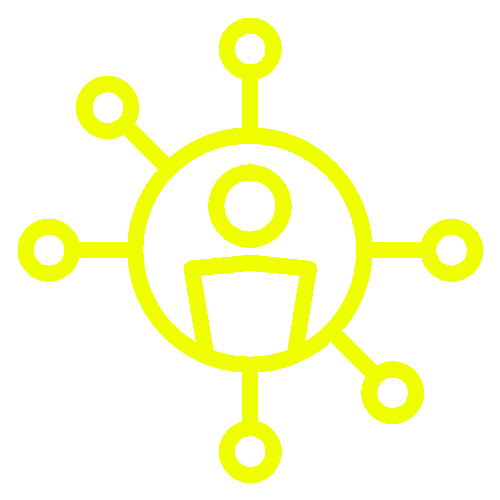 | `social` | dns_block.social | Social Media |  | yes | iOS |
|  | `ssh-100` |  |  |  | no | iOS |
|  | `ssh-50` |  |  |  | no | iOS |
|  | `ssh-500` |  |  |  | no | iOS |
| 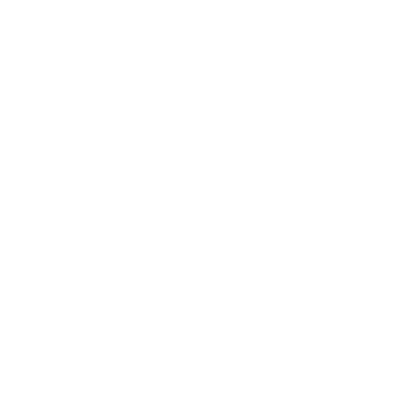 | `trackers` | dns_block.tracking | Tracking & Analytics |  | yes | iOS |
|  | `dns_block` | dns_block | DNS Block |  | yes | iOS |

## Security Event

| Icon | Name | Event Type | Label | Color | Stats Ref | Source |
|------|------|------------|-------|-------|-----------|--------|
| 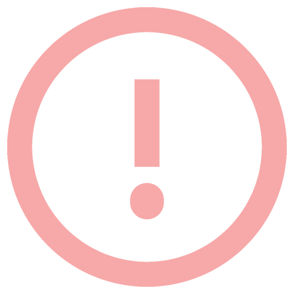 | `dangerious_port` | security_event.dangerous_port | Dangerous Port |  | yes | iOS |
| 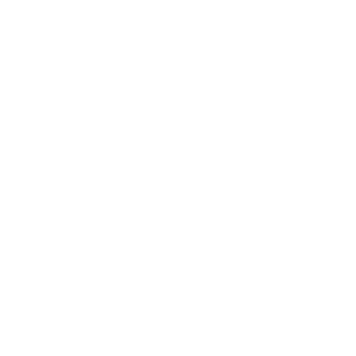 | `dns_bypass` | security_event.dns_bypass | DNS Bypass Attempt |  | yes | iOS |
|  | `dns_nxdomain` | security_event.dns_nxdomain | NXDOMAIN |  | no (emoji) | style (created) |
|  | `dnssec_fail` | security_event.dnssec_fail | DNSSEC Failure |  | no (emoji) | style (created) |
|  | `doh_blocked` | security_event.doh_blocked | DoH Blocked |  | no (emoji) | style (created) |
| 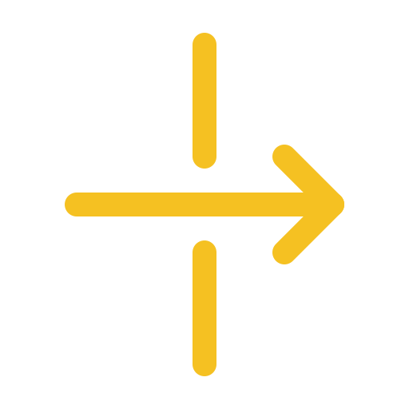 | `doh_bypass` | security_event.doh_bypass | DoH Bypass Attempt |  | no (emoji) | style (created) |
|  | `doh_dot_block` | security_event.doh_dot_block | DoH/DoT Blocked |  | no (emoji) | style (created) |
|  | `exploit_attempt` | security_event.exploit_attempt | Exploit Attempt |  | no (emoji) | style (created) |
|  | `ipv4_leak` | security_event.ipv4_leak | IPv4 Leak |  | yes | iOS |
|  | `ipv4_spoofing` | security_event.ipv4_spoofing | IPv4 Spoofing |  | no (emoji) | style (created) |
| 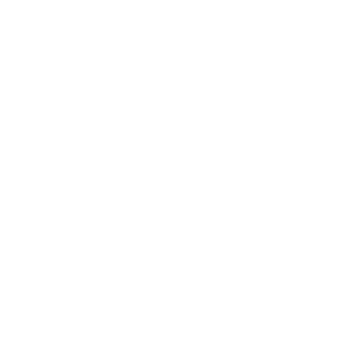 | `ipv6_leak` | security_event.ipv6_leak | IPv6 Leak |  | yes | iOS |
|  | `ipv6_spoofing` | security_event.ipv6_spoofing | IPv6 Spoofing |  | no (emoji) | style (created) |
| 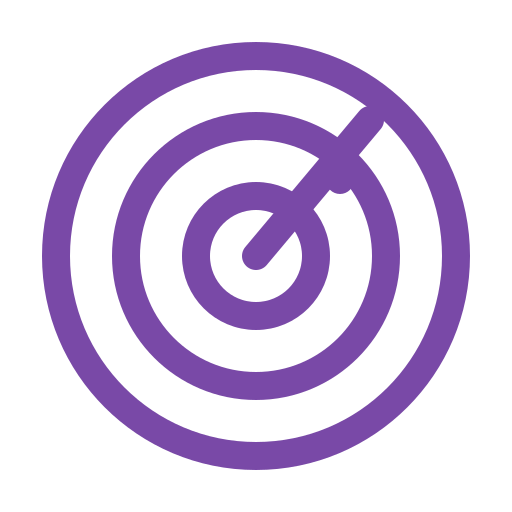 | `port_scan` | security_event.port_scan | Port Scan |  | no (emoji) | style (created) |
|  | `security_event` | security_event | Security Event |  | yes | iOS |
|  | `service_discovery` | security_event.service_discovery | Service Discovery |  | no (emoji) | style (created) |

## Generic

| Icon | Name | Event Type | Label | Color | Stats Ref | Source |
|------|------|------------|-------|-------|-----------|--------|
|  | `browser_security` | generic.browser_security | Browser Security |  | yes | iOS |
| 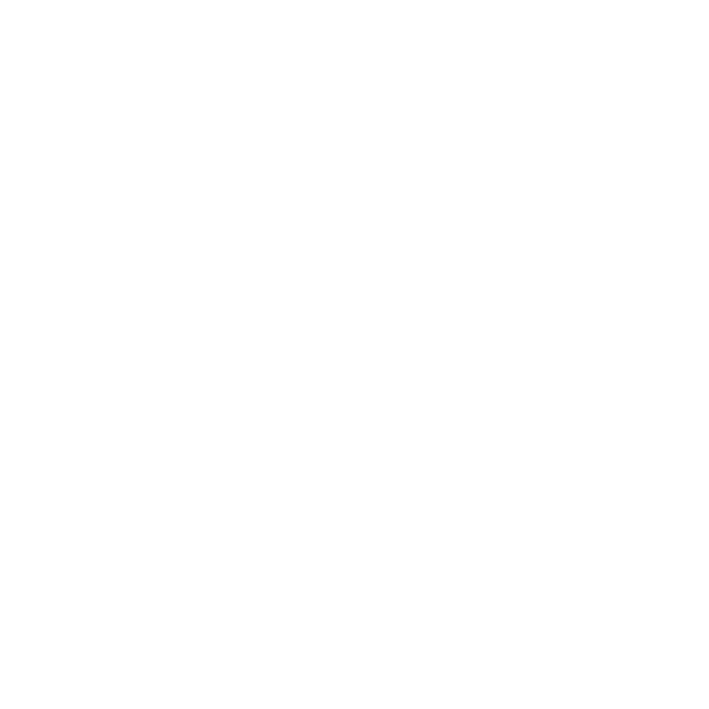 | `browser_settings` | generic.browser_settings | Browser Settings |  | yes | iOS |
| 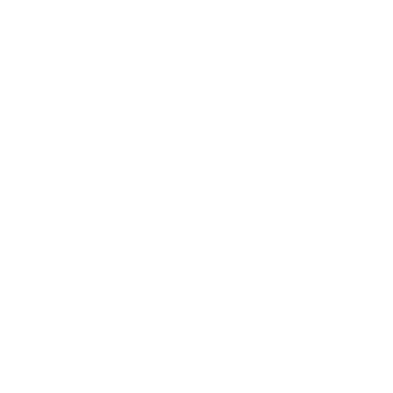 | `censorship` | generic.censorship | Censorship |  | yes | iOS |
|  | `cert` | generic.cert | Certificate |  | yes | iOS |
| 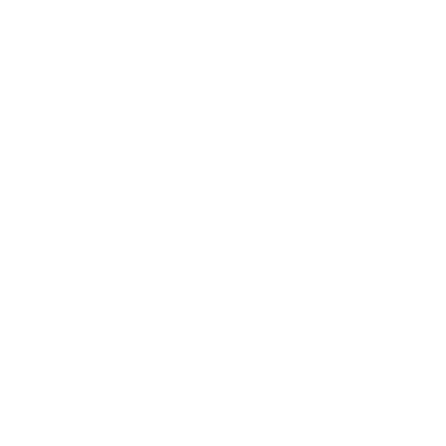 | `connection_health` | generic.connection_health | Connection Health |  | yes | iOS |
| 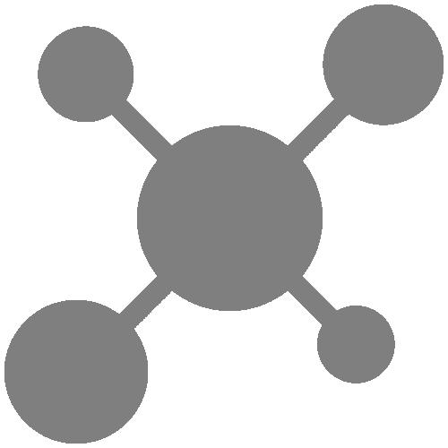 | `connection_off` |  |  |  | no | iOS |
|  | `connection_on` |  |  |  | no | iOS |
| 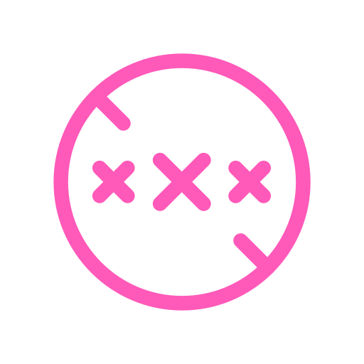 | `content_filtering` | blocklist_group.content_filtering | Content Filtering |  | yes | iOS |
|  | `debug` | generic.debug | Developer Debug |  | yes | iOS |
|  | `deleteaccount` | generic.deleteaccount | Delete Account |  | yes | iOS |
|  | `dns_lock` | generic.dns_lock | Block Domain |  | yes | iOS |
|  | `dns_unlock` | generic.dns_unlock | Unblock Domain |  | yes | iOS |
|  | `dotdoh` | generic.dotdoh | DNS Bypass Protection |  | yes | iOS |
| 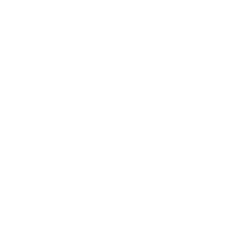 | `eraser` | generic.eraser | Eraser |  | yes | iOS |
| 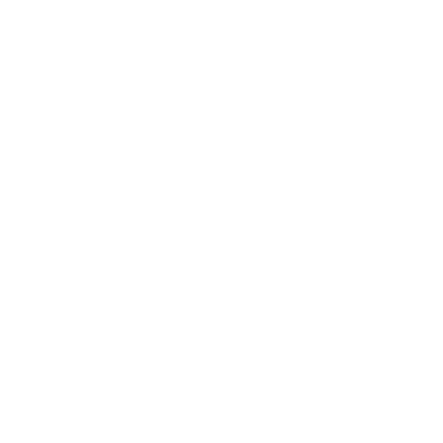 | `fallback` | generic.fallback | Fallback |  | yes | iOS |
| 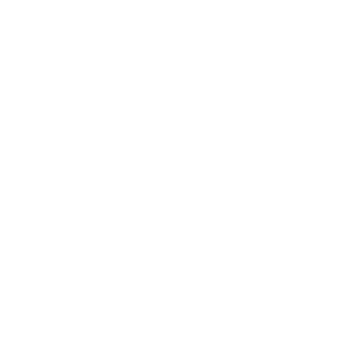 | `ipv4` | generic.ipv4 | IPv4 |  | yes | iOS |
| 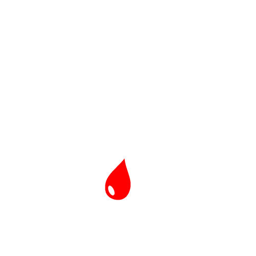 | `killswitch` | generic.killswitch | Kill Switch |  | yes | iOS |
| 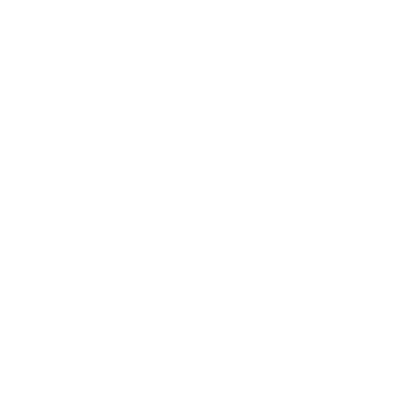 | `location` | generic.location | Location |  | yes | iOS |
|  | `location_services` | generic.location_services | Location Services |  | yes | iOS |
|  | `logs` | generic.logs | View Logs |  | yes | iOS |
|  | `native-telemetry` | blocklist_group.native_telemetry | Native Telemetry |  | yes | iOS |
|  | `onion` | generic.onion | Onion Routing |  | yes | iOS |
|  | `pie_chart` | generic.pie_chart | Pie Chart |  | yes | iOS |
| 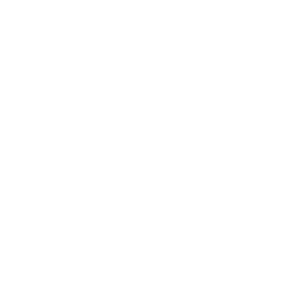 | `pinnedcert` | generic.pinnedcert | Pinned Certificate |  | yes | iOS |
| 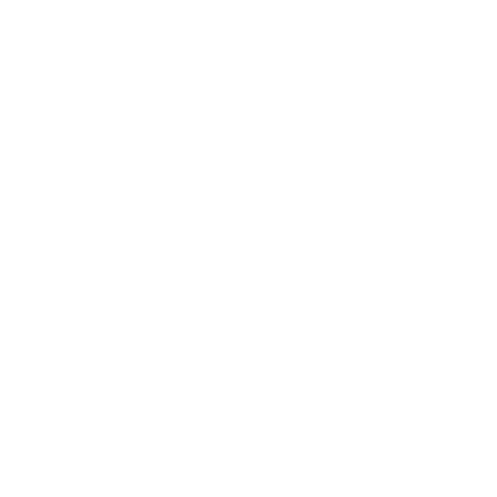 | `portal` | generic.portal | Account Portal |  | yes | iOS |
|  | `portconfig` | generic.portconfig | Port Configuration |  | yes | iOS |
| 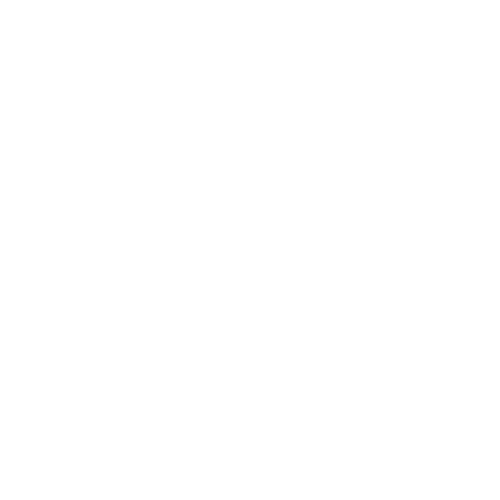 | `profile` | generic.profile | User Profile |  | yes | iOS |
| 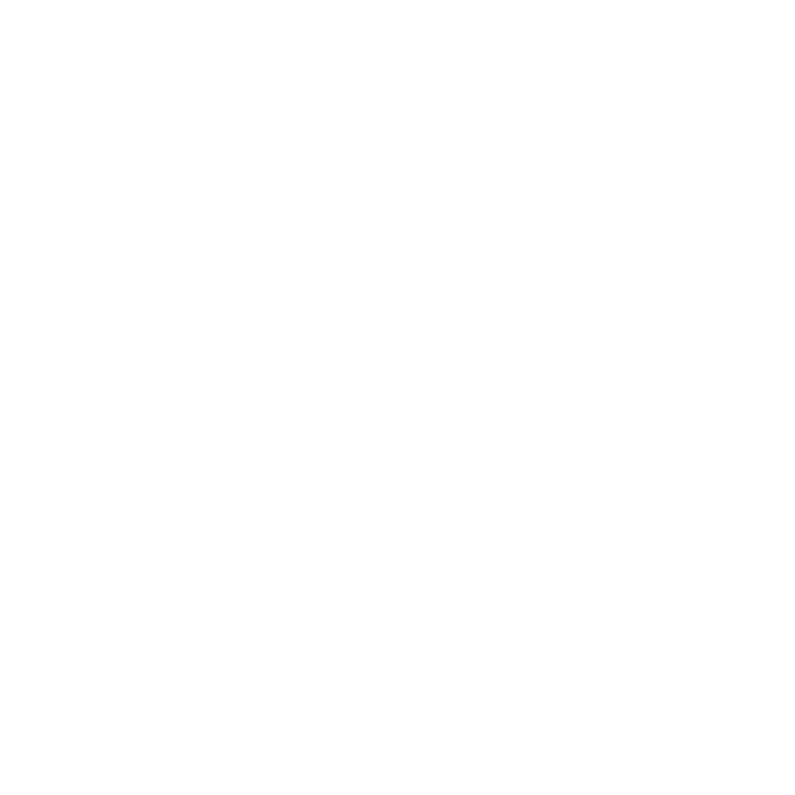 | `profile_wizard` | generic.profile_wizard | Profile Wizard |  | yes | iOS |
|  | `reconnect` | generic.reconnect | Connect on Startup |  | yes | iOS |
|  | `recovery_codes` | generic.recovery_codes | Recovery Codes |  | yes | iOS |
| 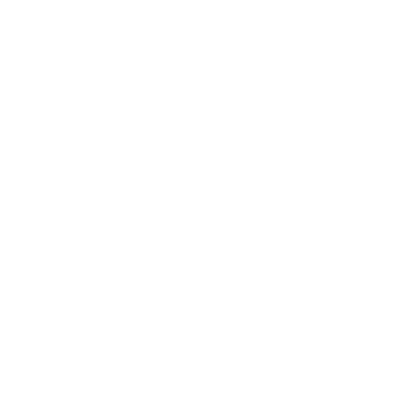 | `scattercast` | generic.scattercast | Scattercast |  | yes | iOS |
|  | `security_off` |  |  |  | no | iOS |
|  | `security_on` |  |  |  | no | iOS |
| 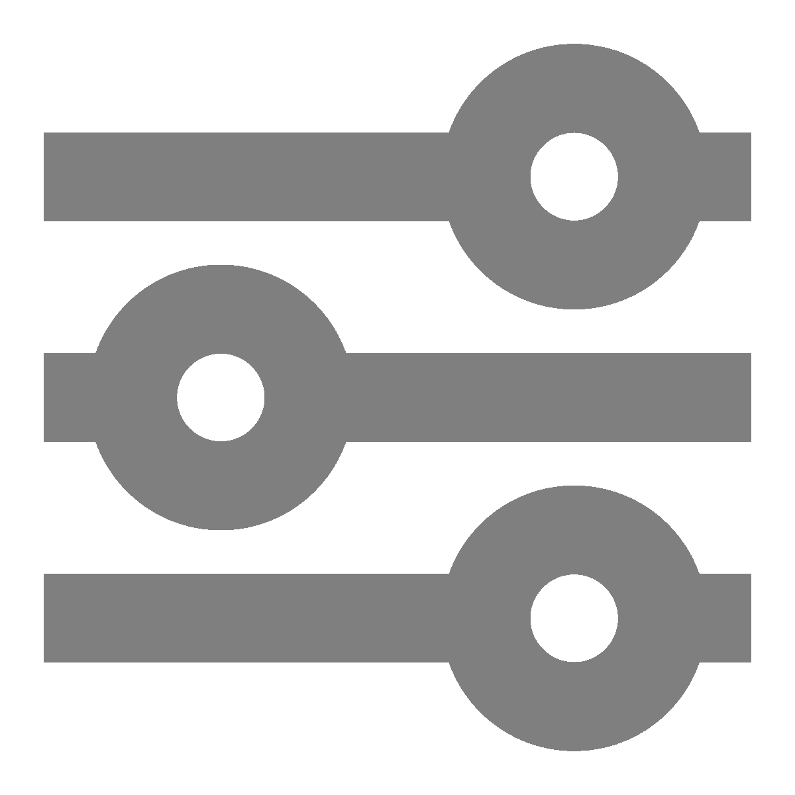 | `settings_off` |  |  |  | no | iOS |
|  | `settings_on` |  |  |  | no | iOS |
|  | `smartblocking` | generic.smartblocking | Smart Blocking |  | yes | iOS |
| 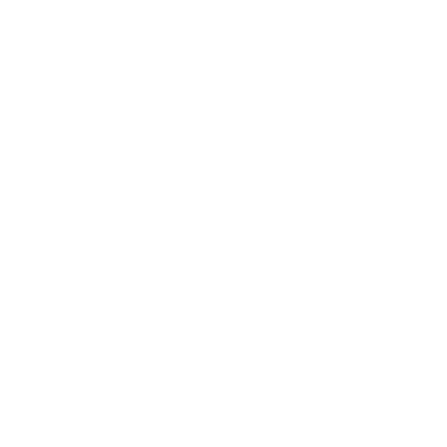 | `streaming` | generic.streaming | Streaming |  | yes | iOS |
| 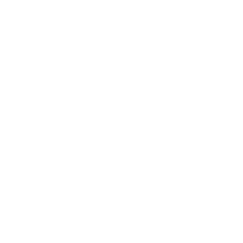 | `subscription` | generic.subscription | Subscription |  | yes | iOS |
|  | `swipe_up` |  |  |  | no | iOS |
| 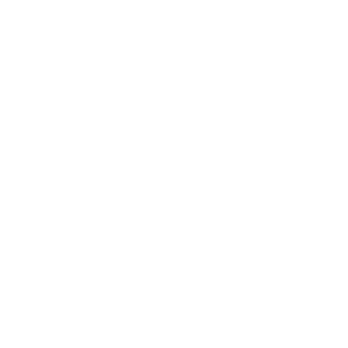 | `time_series` | generic.time_series | Time Series |  | yes | iOS |
|  | `tinfoil_hat` | generic.tinfoil_hat | Tinfoil Hat |  | yes | iOS |
|  | `token` | generic.token | Your Token |  | yes | iOS |
|  | `websocket` | generic.websocket | WebSocket Transport |  | yes | iOS |
